# Benchmark trend

Instruction and allocation counts per iteration on master, one record per commit (37 so far, latest [b23c319](https://github.com/jinja2cpp/Jinja2Cpp/commit/b23c3197fa26d03e3aaf56db767f16f810359c1f) on 2026-10-06). Written by the `trend` job of `.github/workflows/benchmark.yml` with `bench/trend.py`; the data is `history.jsonl`.

Memory is the bytes a loaded template keeps for `Load/*` and the peak heap use of one render for `Render/*`; vs first compares with the first record that has it.

| Benchmark | Instructions | vs previous | vs first | Allocations | vs previous | vs first | Memory | vs previous | vs first |
|---|---:|---:|---:|---:|---:|---:|---:|---:|---:|
| [Load/chat_llama](#loadchat_llama) | 668,570 | -0.17% |  | 403 | 0% |  | 39,456 | 0% | +0.96% |
| [Render/chat_llama](#renderchat_llama) | 427,603 | -0.02% |  | 349 | 0% |  | 13,320 | 0% | -7.24% |
| [Load/chat_mistral](#loadchat_mistral) | 779,775 | +0.11% |  | 459 | 0% |  | 45,408 | -0.11% | +1.70% |
| [Render/chat_mistral](#renderchat_mistral) | 748,230 | +0.20% |  | 502 | 0% |  | 11,752 | +0.55% | -11.02% |
| [Load/chat_qwen](#loadchat_qwen) | 501,142 | +0.04% |  | 312 | 0% |  | 27,832 | +0.06% | +1.84% |
| [Render/chat_qwen](#renderchat_qwen) | 423,888 | +0.50% |  | 359 | 0% |  | 7,464 | 0% | -12.23% |
| [Load/config_file](#loadconfig_file) | 173,768 | -0.18% |  | 133 | 0% |  | 10,632 | 0% | +0.68% |
| [Render/config_file](#renderconfig_file) | 2,148,632 | +0.20% |  | 1,845 | 0% |  | 21,496 | +0.15% | -9.71% |
| [Load/dict_ops](#loaddict_ops) | 62,782 | +0.42% | -57.52% | 61 | 0% | -53.44% | 4,312 | 0% | +1.32% |
| [Render/dict_ops](#renderdict_ops) | 413,857 | +0.02% | -40.09% | 317 | 0% | -29.56% | 34,120 | 0% | -1.66% |
| [Load/expressions](#loadexpressions) | 84,485 | -0.63% | -59.02% | 82 | 0% | -43.84% | 6,304 | +0.25% | +2.74% |
| [Render/expressions](#renderexpressions) | 555,150 | 0% | -38.73% | 4 | 0% | -86.67% | 2,576 | 0% | -27.31% |
| [Load/filters](#loadfilters) | 128,718 | +0.54% | -53.10% | 114 | 0% | -50.00% | 11,488 | -0.28% | +0.63% |
| [Render/filters](#renderfilters) | 63,332 | -0.28% | -28.57% | 47 | 0% | -36.49% | 4,336 | 0% | -11.73% |
| [Load/for_filter_if](#loadfor_filter_if) | 52,703 | +0.01% | -61.07% | 56 | 0% | -54.47% | 3,504 | 0% | +1.62% |
| [Render/for_filter_if](#renderfor_filter_if) | 518,356 | +0.02% | -40.11% | 207 | 0% | -8.41% | 2,656 | 0% | -27.03% |
| [Load/for_loop_vars](#loadfor_loop_vars) | 68,612 | -0.01% | -62.02% | 67 | 0% | -57.32% | 4,560 | 0% | +0.88% |
| [Render/for_loop_vars](#renderfor_loop_vars) | 618,130 | +0.25% | -42.38% | 503 | 0% | -3.64% | 1,728 | 0% | -37.57% |
| [Load/for_range](#loadfor_range) | 28,133 | +0.13% | -50.37% | 37 | 0% | -33.93% | 2,040 | 0% | +2.00% |
| [Render/for_range](#renderfor_range) | 51,607 | 0% | -44.03% | 4 | 0% | -85.19% | 544 | 0% | -64.02% |
| [Load/html_autoescape](#loadhtml_autoescape) | 358,258 | +0.01% |  | 274 | 0% |  | 25,008 | 0% | +1.33% |
| [Render/html_autoescape](#renderhtml_autoescape) | 1,825,096 | +0.05% |  | 1,074 | 0% |  | 38,688 | 0% | -4.20% |
| [Load/inheritance](#loadinheritance) | 45,560 | +0.11% | -60.08% | 51 | 0% | -52.34% | 2,912 | 0% | +1.39% |
| [Render/inheritance](#renderinheritance) | 283,295 | -0.12% | -62.12% | 155 | 0% | -75.08% | 3,824 | 0% | -36.44% |
| [Load/large_static](#loadlarge_static) | 301,884 | +0.29% | -65.93% | 193 | 0% | -56.14% | 53,376 | 0% | -0.01% |
| [Render/large_static](#renderlarge_static) | 31,988 | -0.04% | -57.43% | 2 | 0% | -88.89% | 36,656 | 0% | -1.55% |
| [Load/macros](#loadmacros) | 97,571 | -0.29% | -57.20% | 95 | 0% | -48.92% | 6,272 | 0% | +0.90% |
| [Render/macros](#rendermacros) | 1,180,498 | -0.02% | -53.94% | 408 | 0% | -85.05% | 13,680 | 0% | -7.07% |
| [Load/many_tags](#loadmany_tags) | 16,460,925 | 0% | -62.73% | 9,659 | 0% | -71.80% | 1,060,064 | 0% | +0.46% |
| [Render/many_tags](#rendermany_tags) | 1,293,864 | 0% | -37.88% | 3 | 0% | -85.71% | 5,736 | 0% | -9.13% |
| [Load/mitsuhiko_table](#loadmitsuhiko_table) | 98,083 | -0.53% | -58.71% | 95 | 0% | -48.37% | 6,136 | -0.26% | +1.19% |
| [Render/mitsuhiko_table](#rendermitsuhiko_table) | 7,263,498 | 0% | -41.22% | 1,026 | 0% | -74.69% | 345,968 | 0% | -0.30% |
| [Load/mitsuhiko_table_wide](#loadmitsuhiko_table_wide) | 125,756 | -0.08% |  | 132 | 0% |  | 8,320 | 0% | +0.68% |
| [Render/mitsuhiko_table_wide](#rendermitsuhiko_table_wide) | 7,614,860 | 0% |  | 1,047 | 0% |  | 1,379,952 | 0% | -0.08% |
| [Load/plain_text](#loadplain_text) | 9,006 | 0% | -6.92% | 16 | 0% | -11.11% | 1,144 | 0% | +2.14% |
| [Render/plain_text](#renderplain_text) | 2,333 | 0% | -65.66% | 2 | 0% | -83.33% | 144 | 0% | -80.00% |
| [Load/strings](#loadstrings) | 123,918 | 0% | -57.54% | 106 | 0% | -52.68% | 9,368 | 0% | +3.63% |
| [Render/strings](#renderstrings) | 1,114,124 | +0.01% | -46.88% | 1,083 | 0% | -48.77% | 17,352 | 0% | -3.21% |
| [Load/substitute](#loadsubstitute) | 17,144 | +0.21% | -42.58% | 27 | 0% | -27.03% | 1,544 | 0% | +1.58% |
| [Render/substitute](#rendersubstitute) | 4,111 | 0% | -53.36% | 2 | 0% | -83.33% | 144 | 0% | -80.00% |

## Cache misses

Misses per iteration in callgrind's cache model (`count.py --cache-sim`: 32 KB 8-way L1, 8 MB 16-way last level, no prefetcher); reported, not gated.

| Benchmark | D1 read misses | vs previous | D1 write misses | vs previous | LL data read misses | vs previous | I1 misses | vs previous |
|---|---:|---:|---:|---:|---:|---:|---:|---:|
| Load/chat_llama | 2,015 |  | 1,432 |  | 0 |  | 10,450 |  |
| Render/chat_llama | 1,903 |  | 553 |  | 0 |  | 5,407 |  |
| Load/chat_mistral | 2,399 |  | 1,845 |  | 0 |  | 11,997 |  |
| Render/chat_mistral | 3,578 |  | 853 |  | 0 |  | 15,538 |  |
| Load/chat_qwen | 1,391 |  | 1,294 |  | 0 |  | 6,511 |  |
| Render/chat_qwen | 2,074 |  | 397 |  | 0 |  | 4,600 |  |
| Load/config_file | 660 |  | 575 |  | 0 |  | 4,175 |  |
| Render/config_file | 12,678 |  | 2,532 |  | 0 |  | 77,950 |  |
| Load/dict_ops | 186 |  | 132 |  | 0 |  | 1,773 |  |
| Render/dict_ops | 1,117 |  | 643 |  | 0 |  | 1,311 |  |
| Load/expressions | 253 |  | 220 |  | 0 |  | 1,608 |  |
| Render/expressions | 31 |  | 13 |  | 0 |  | 592 |  |
| Load/filters | 481 |  | 285 |  | 0 |  | 3,447 |  |
| Render/filters | 210 |  | 106 |  | 0 |  | 1,328 |  |
| Load/for_filter_if | 129 |  | 66 |  | 0 |  | 1,252 |  |
| Render/for_filter_if | 1,349 |  | 66 |  | 0 |  | 566 |  |
| Load/for_loop_vars | 147 |  | 126 |  | 0 |  | 1,472 |  |
| Render/for_loop_vars | 96 |  | 17 |  | 0 |  | 1,310 |  |
| Load/for_range | 40 |  | 44 |  | 0 |  | 920 |  |
| Render/for_range | 6 |  | 4 |  | 0 |  | 363 |  |
| Load/html_autoescape | 1,161 |  | 857 |  | 0 |  | 5,961 |  |
| Render/html_autoescape | 11,121 |  | 2,592 |  | 0 |  | 63,227 |  |
| Load/inheritance | 28 |  | 21 |  | 0 |  | 1,031 |  |
| Render/inheritance | 875 |  | 141 |  | 0 |  | 3,892 |  |
| Load/large_static | 2,843 |  | 1,261 |  | 0 |  | 894 |  |
| Render/large_static | 920 |  | 580 |  | 0 |  | 20 |  |
| Load/macros | 303 |  | 274 |  | 0 |  | 1,949 |  |
| Render/macros | 720 |  | 207 |  | 0 |  | 7,174 |  |
| Load/many_tags | 56,112 |  | 29,371 |  | 0 |  | 362,055 |  |
| Render/many_tags | 13,625 |  | 1,663 |  | 0 |  | 2,385 |  |
| Load/mitsuhiko_table | 217 |  | 233 |  | 0 |  | 1,283 |  |
| Render/mitsuhiko_table | 8,080 |  | 5,188 |  | 0 |  | 712 |  |
| Load/mitsuhiko_table_wide | 392 |  | 384 |  | 0 |  | 1,908 |  |
| Render/mitsuhiko_table_wide | 8,389 |  | 21,514 |  | 0 |  | 5,550 |  |
| Load/plain_text | 0 |  | 0 |  | 0 |  | 12 |  |
| Render/plain_text | 0 |  | 1 |  | 0 |  | 9 |  |
| Load/strings | 448 |  | 351 |  | 0 |  | 3,665 |  |
| Render/strings | 988 |  | 1,397 |  | 0 |  | 3,800 |  |
| Load/substitute | 7 |  | 7 |  | 0 |  | 430 |  |
| Render/substitute | 0 |  | 0 |  | 0 |  | 5 |  |

## Charts

### Load/chat_llama

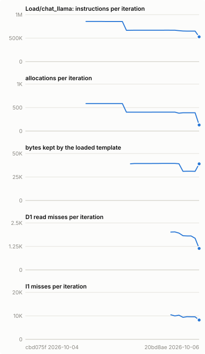

### Render/chat_llama

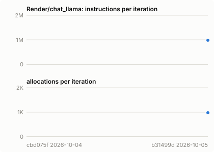

### Load/chat_mistral

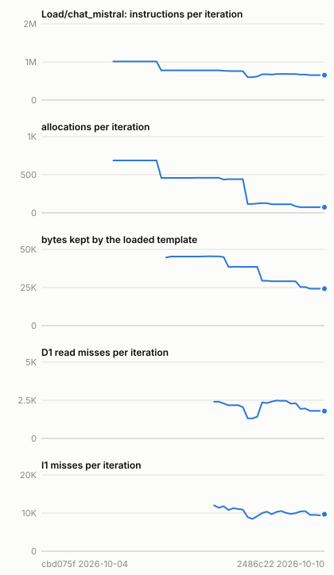

### Render/chat_mistral

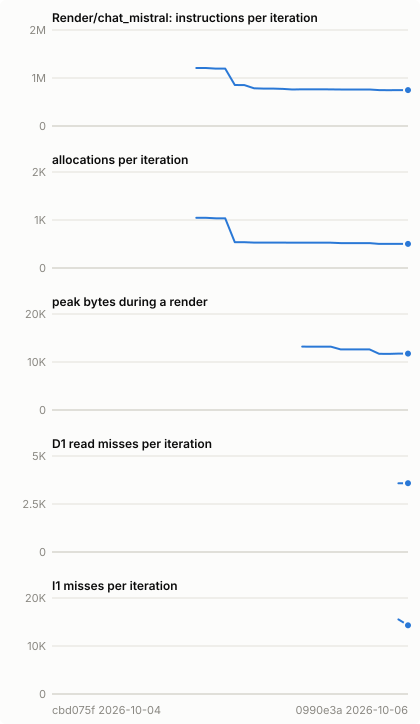

### Load/chat_qwen

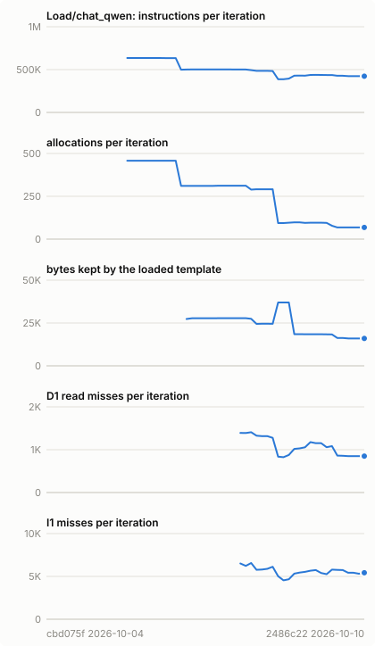

### Render/chat_qwen

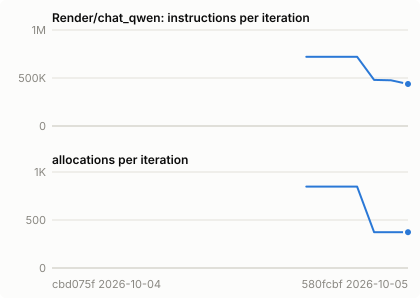

### Load/config_file

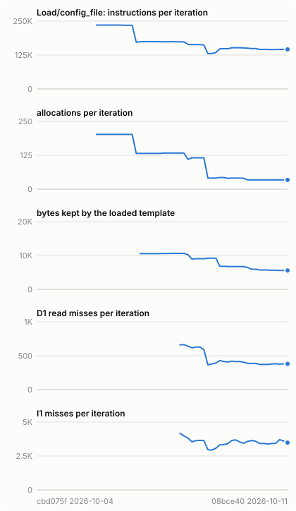

### Render/config_file

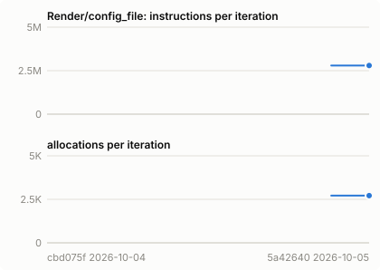

### Load/dict_ops

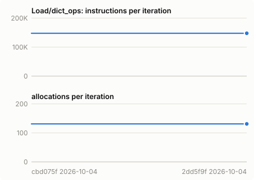

### Render/dict_ops

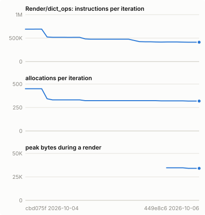

### Load/expressions

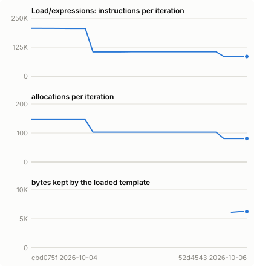

### Render/expressions

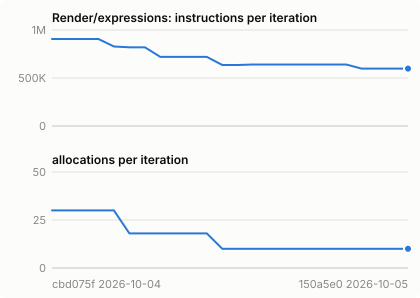

### Load/filters

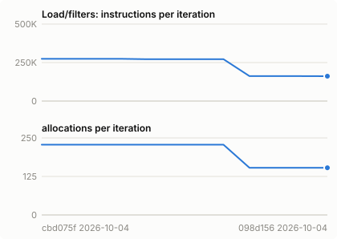

### Render/filters

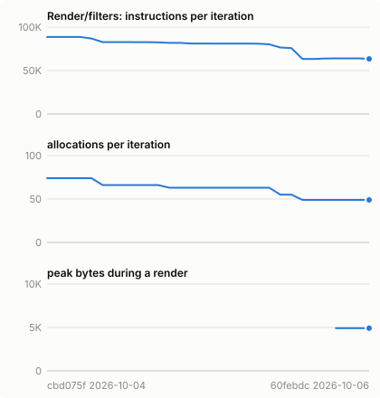

### Load/for_filter_if

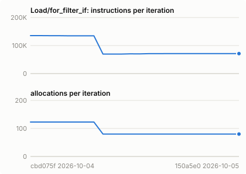

### Render/for_filter_if

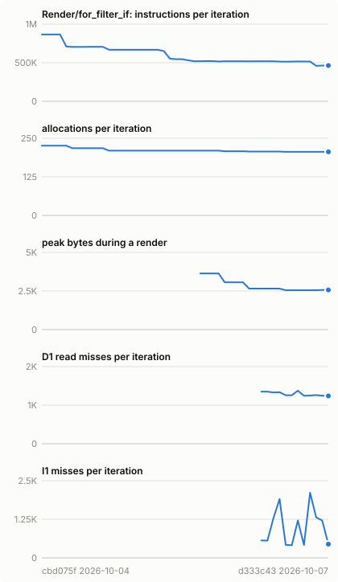

### Load/for_loop_vars

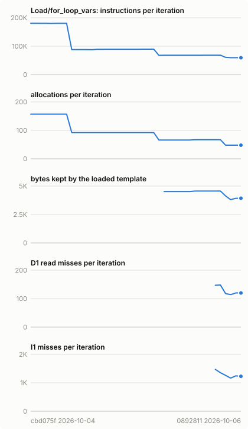

### Render/for_loop_vars

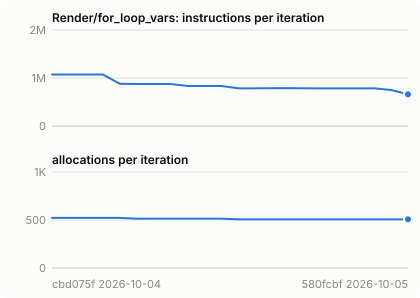

### Load/for_range

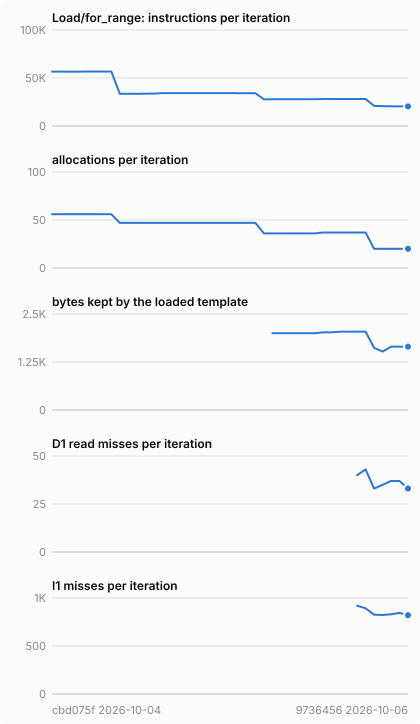

### Render/for_range

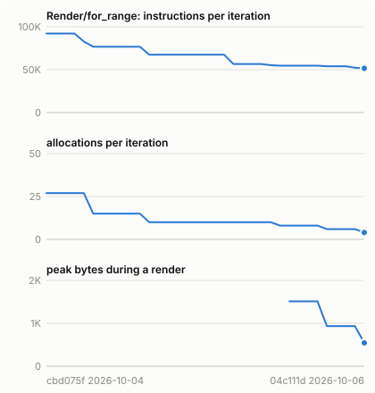

### Load/html_autoescape

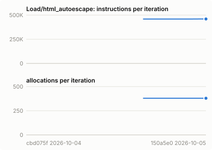

### Render/html_autoescape

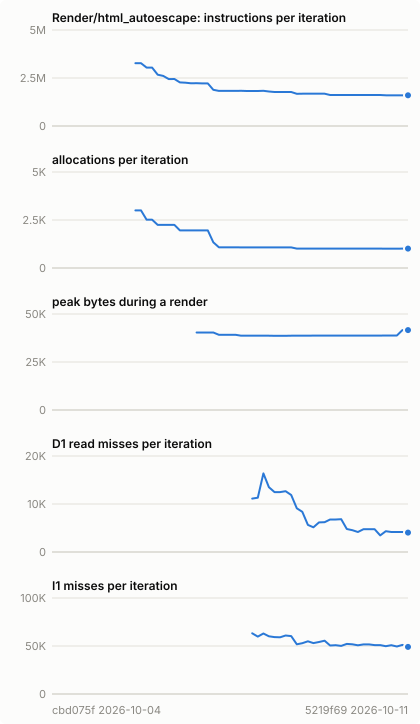

### Load/inheritance

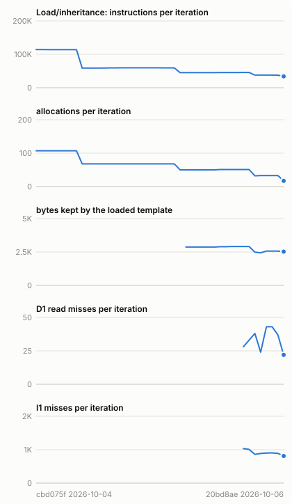

### Render/inheritance

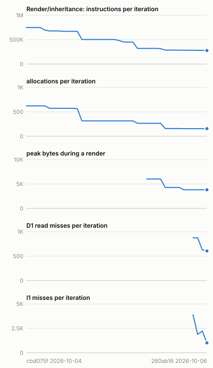

### Load/large_static

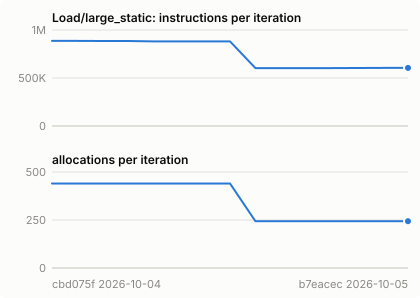

### Render/large_static

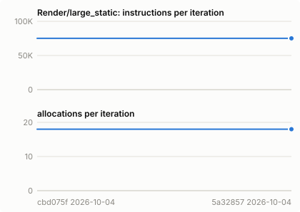

### Load/macros

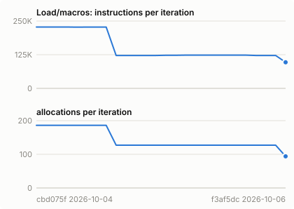

### Render/macros

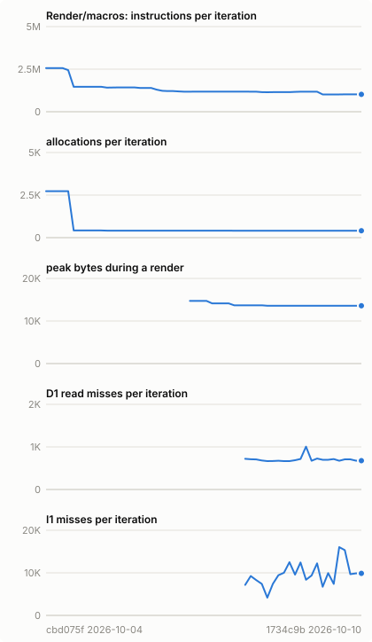

### Load/many_tags

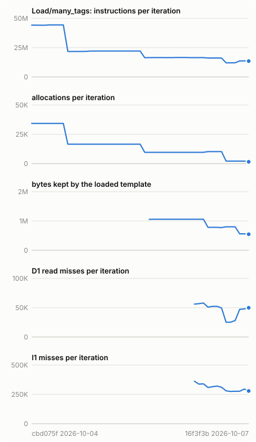

### Render/many_tags

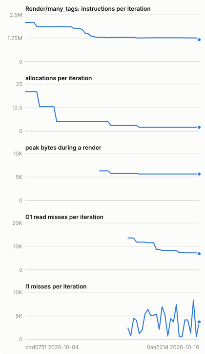

### Load/mitsuhiko_table

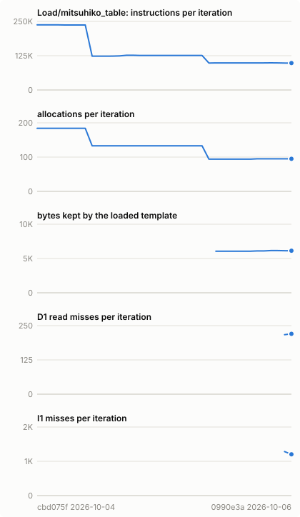

### Render/mitsuhiko_table

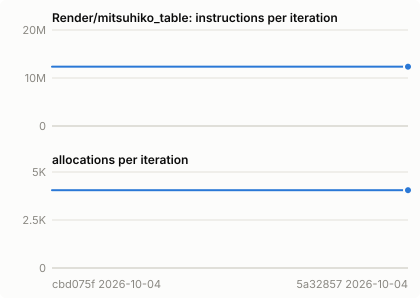

### Load/mitsuhiko_table_wide

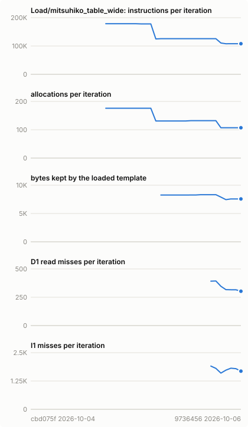

### Render/mitsuhiko_table_wide

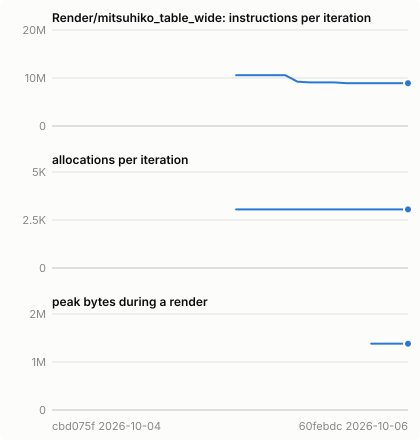

### Load/plain_text

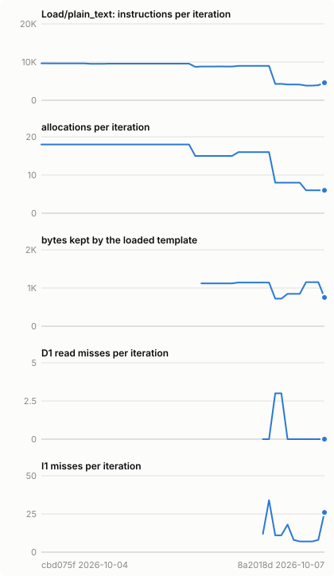

### Render/plain_text

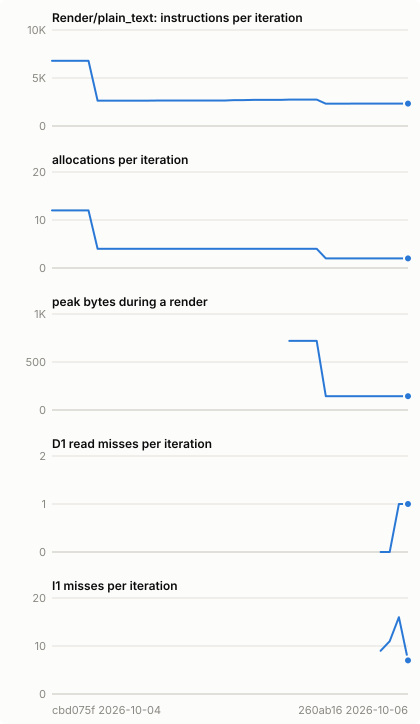

### Load/strings

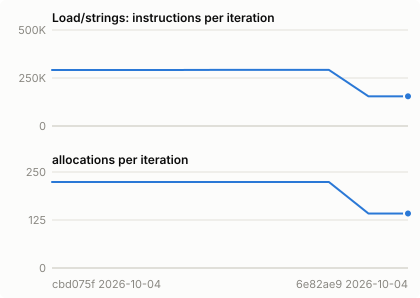

### Render/strings

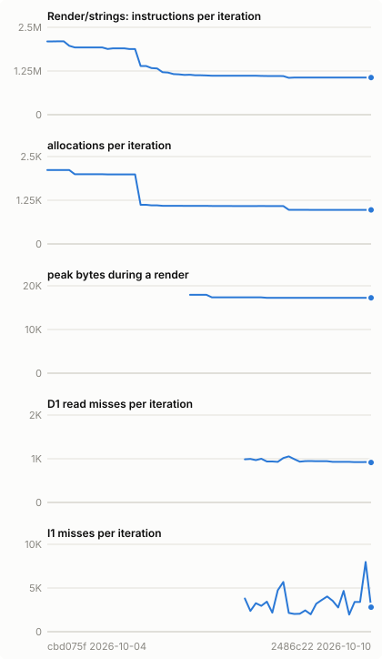

### Load/substitute

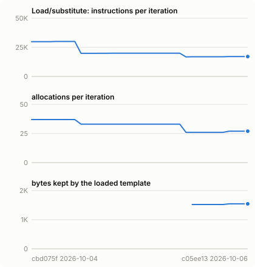

### Render/substitute

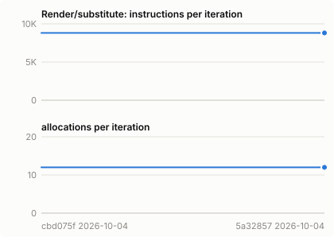
