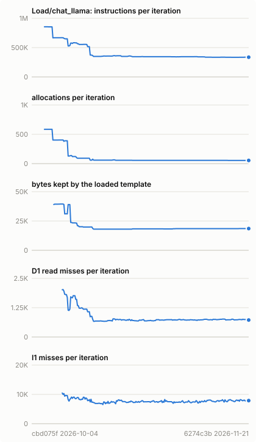
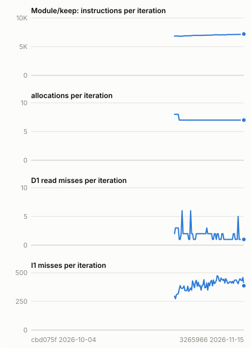
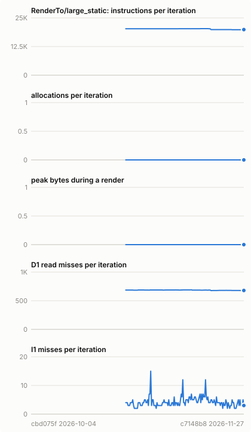
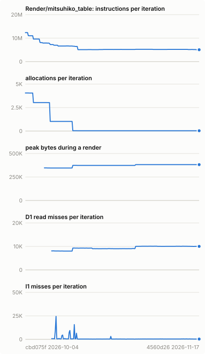

# Benchmark trend

Instruction and allocation counts per iteration on master, one record per commit (264 so far, latest [dafffa9](https://github.com/jinja2cpp/Jinja2Cpp/commit/dafffa9823f2b9e070598e04a307dc9159570b19) on 2026-11-22). Written by the `trend` job of `.github/workflows/benchmark.yml` with `bench/trend.py`; the data is `history.jsonl`.

Memory is the bytes a loaded template keeps for `Load/*` and the peak heap use of one render for `Render/*`; vs first compares with the first record that has it.

| Benchmark | Instructions | vs previous | vs first | Allocations | vs previous | vs first | Memory | vs previous | vs first |
|---|---:|---:|---:|---:|---:|---:|---:|---:|---:|
| [Load/big_int_radix](#loadbig_int_radix) | 42,895 | 0% |  | 14 | 0% |  | 2,688 | 0% | 0% |
| [Render/big_int_radix](#renderbig_int_radix) | 308,312,466 | 0% |  | 163 | 0% |  | 1,540,760 | 0% | -39.13% |
| [Load/chat_llama](#loadchat_llama) | 336,602 | 0% |  | 54 | 0% |  | 18,536 | 0% | -52.57% |
| [Render/chat_llama](#renderchat_llama) | 292,511 | +0.33% |  | 224 | 0% |  | 11,608 | 0% | -19.16% |
| [Load/chat_mistral](#loadchat_mistral) | 385,002 | 0% |  | 51 | 0% |  | 20,976 | 0% | -53.02% |
| [Render/chat_mistral](#renderchat_mistral) | 492,892 | +0.17% |  | 392 | 0% |  | 9,752 | 0% | -26.17% |
| [Load/chat_qwen](#loadchat_qwen) | 261,943 | 0% |  | 43 | 0% |  | 14,472 | 0% | -47.04% |
| [Render/chat_qwen](#renderchat_qwen) | 274,277 | +0.33% |  | 211 | 0% |  | 8,280 | 0% | -2.63% |
| [Load/config_file](#loadconfig_file) | 94,181 | 0% |  | 24 | 0% |  | 5,520 | 0% | -47.73% |
| [Render/config_file](#renderconfig_file) | 1,278,420 | +0.01% |  | 908 | 0% |  | 25,960 | 0% | +9.04% |
| [Load/dict_ops](#loaddict_ops) | 31,883 | 0% | -78.42% | 8 | 0% | -93.89% | 2,216 | 0% | -47.93% |
| [Render/dict_ops](#renderdict_ops) | 290,693 | 0% | -57.92% | 112 | 0% | -75.11% | 24,408 | 0% | -29.65% |
| [Load/expressions](#loadexpressions) | 43,776 | 0% | -78.76% | 15 | 0% | -89.73% | 2,752 | 0% | -55.15% |
| [Render/expressions](#renderexpressions) | 414,401 | 0% | -54.27% | 3 | 0% | -90.00% | 2,440 | 0% | -31.15% |
| [Load/filters](#loadfilters) | 66,923 | 0% | -75.61% | 26 | 0% | -88.60% | 3,856 | 0% | -66.22% |
| [Render/filters](#renderfilters) | 26,520 | 0% | -70.09% | 23 | 0% | -68.92% | 752 | 0% | -84.69% |
| [Load/for_filter_if](#loadfor_filter_if) | 28,522 | 0% | -78.93% | 6 | 0% | -95.12% | 1,928 | 0% | -44.08% |
| [Render/for_filter_if](#renderfor_filter_if) | 266,154 | 0% | -69.25% | 4 | 0% | -98.23% | 16,560 | 0% | +354.95% |
| [Load/for_loop_vars](#loadfor_loop_vars) | 38,180 | 0% | -78.87% | 9 | 0% | -94.27% | 2,392 | 0% | -47.08% |
| [Render/for_loop_vars](#renderfor_loop_vars) | 170,801 | 0% | -84.08% | 2 | 0% | -99.62% | 1,568 | 0% | -43.35% |
| [Load/for_range](#loadfor_range) | 12,493 | 0% | -77.96% | 6 | 0% | -89.29% | 1,128 | 0% | -43.60% |
| [Render/for_range](#renderfor_range) | 37,183 | 0% | -59.68% | 3 | 0% | -88.89% | 408 | 0% | -73.02% |
| [Load/hf_deepseek_v31](#loadhf_deepseek_v31) | 384,091 | 0% |  | 54 | 0% |  | 22,032 | 0% | +0.99% |
| [Render/hf_deepseek_v31](#renderhf_deepseek_v31) | 90,596 | 0% |  | 42 | 0% |  | 2,456 | 0% | -0.97% |
| [Load/hf_gpt_oss](#loadhf_gpt_oss) | 1,525,610 | -0.02% |  | 282 | 0% |  | 75,000 | -0.02% | +1.05% |
| [Render/hf_gpt_oss](#renderhf_gpt_oss) | 169,375 | 0% |  | 153 | 0% |  | 5,984 | 0% | +21.23% |
| [Load/hf_mistral_small](#loadhf_mistral_small) | 591,363 | 0% |  | 87 | 0% |  | 33,136 | 0% | +0.61% |
| [Render/hf_mistral_small](#renderhf_mistral_small) | 140,367 | 0% |  | 97 | 0% |  | 6,096 | 0% | -0.65% |
| [Load/hf_qwen3](#loadhf_qwen3) | 477,659 | 0% |  | 81 | 0% |  | 25,648 | 0% | +0.66% |
| [Render/hf_qwen3](#renderhf_qwen3) | 117,518 | 0% |  | 99 | 0% |  | 3,224 | 0% | -0.74% |
| [Load/html_autoescape](#loadhtml_autoescape) | 189,012 | 0% |  | 42 | 0% |  | 12,728 | 0% | -48.43% |
| [Render/html_autoescape](#renderhtml_autoescape) | 1,197,364 | 0% |  | 674 | 0% |  | 46,256 | 0% | +14.54% |
| [Load/inheritance](#loadinheritance) | 21,300 | 0% | -81.34% | 6 | 0% | -94.39% | 1,368 | 0% | -52.37% |
| [Render/inheritance](#renderinheritance) | 136,800 | 0% | -81.71% | 35 | 0% | -94.37% | 8,168 | 0% | +35.77% |
| [Load/int_arith](#loadint_arith) | 64,666 | 0% |  | 19 | 0% |  | 3,896 | 0% | +1.04% |
| [Render/int_arith](#renderint_arith) | 824,338 | 0% |  | 12 | 0% |  | 3,272 | 0% | -0.49% |
| [Module/keep](#modulekeep) | 6,989 | 0% |  | 6 | 0% |  |  |  |  |
| [Module/keep_written](#modulekeep_written) | 28,988 | 0% |  | 10 | 0% |  |  |  |  |
| [Load/large_static](#loadlarge_static) | 146,958 | 0% | -83.41% | 13 | 0% | -97.05% | 43,128 | 0% | -19.21% |
| [Render/large_static](#renderlarge_static) | 20,342 | 0% | -72.93% | 1 | 0% | -94.44% | 36,552 | 0% | -1.83% |
| [RenderSink/large_static](#rendersinklarge_static) | 12,631 | 0% |  | 0 |  |  | 0 |  |  |
| [RenderTo/large_static](#rendertolarge_static) | 19,845 | 0% |  | 0 |  |  | 0 |  |  |
| [Load/macros](#loadmacros) | 54,293 | 0% | -76.18% | 25 | 0% | -86.56% | 4,472 | 0% | -28.06% |
| [Render/macros](#rendermacros) | 647,390 | 0% | -74.74% | 308 | 0% | -88.71% | 20,608 | 0% | +40.00% |
| [Load/many_tags](#loadmany_tags) | 8,753,681 | 0% | -80.18% | 950 | 0% | -97.23% | 438,136 | 0% | -58.48% |
| [Render/many_tags](#rendermany_tags) | 730,657 | 0% | -64.92% | 2 | 0% | -90.48% | 5,648 | 0% | -10.52% |
| [Load/mitsuhiko_table](#loadmitsuhiko_table) | 44,630 | 0% | -81.21% | 18 | 0% | -90.22% | 3,416 | 0% | -43.67% |
| [Render/mitsuhiko_table](#rendermitsuhiko_table) | 5,105,184 | 0% | -58.68% | 33 | 0% | -99.19% | 381,536 | 0% | +9.95% |
| [RenderSink/mitsuhiko_table](#rendersinkmitsuhiko_table) | 5,035,279 | 0% |  | 32 | 0% |  | 37,064 | 0% | +28.59% |
| [RenderTo/mitsuhiko_table](#rendertomitsuhiko_table) | 5,104,640 | 0% |  | 32 | 0% |  | 37,064 | 0% | +28.59% |
| [Load/mitsuhiko_table_wide](#loadmitsuhiko_table_wide) | 52,115 | 0% |  | 34 | 0% |  | 5,744 | 0% | -30.49% |
| [Render/mitsuhiko_table_wide](#rendermitsuhiko_table_wide) | 5,451,418 | 0% |  | 33 | 0% |  | 1,414,928 | 0% | +2.46% |
| [RenderSink/mitsuhiko_table_wide](#rendersinkmitsuhiko_table_wide) | 5,277,323 | 0% |  | 32 | 0% |  | 37,064 | 0% | +28.59% |
| [RenderTo/mitsuhiko_table_wide](#rendertomitsuhiko_table_wide) | 5,450,812 | 0% |  | 32 | 0% |  | 37,064 | 0% | +28.59% |
| [Nested/new_template](#nestednew_template) | 452,566 | 0% |  | 323 | 0% |  |  |  |  |
| [Load/plain_text](#loadplain_text) | 2,932 | 0% | -69.70% | 3 | 0% | -83.33% | 680 | 0% | -39.29% |
| [Render/plain_text](#renderplain_text) | 972 | 0% | -85.69% | 1 | 0% | -91.67% | 40 | 0% | -94.44% |
| [RenderSink/plain_text](#rendersinkplain_text) | 677 | 0% |  | 0 |  |  | 0 |  |  |
| [RenderTo/plain_text](#rendertoplain_text) | 773 | 0% |  | 0 |  |  | 0 |  |  |
| [Load/prompt_budget](#loadprompt_budget) | 34,256 | 0% |  | 17 | 0% |  | 2,248 | 0% | +1.08% |
| [Render/prompt_budget](#renderprompt_budget) | 1,321,775 | 0% |  | 76 | 0% |  | 36,416 | 0% | 0% |
| [Nested/shared_globals](#nestedshared_globals) | 160,766 | 0% |  | 160 | 0% |  |  |  |  |
| [Load/strings](#loadstrings) | 68,836 | 0% | -76.41% | 29 | 0% | -87.05% | 4,384 | 0% | -51.50% |
| [Render/strings](#renderstrings) | 581,065 | 0% | -72.30% | 344 | 0% | -83.73% | 9,088 | 0% | -49.31% |
| [Load/substitute](#loadsubstitute) | 6,654 | 0% | -77.71% | 5 | 0% | -86.49% | 840 | 0% | -44.74% |
| [Render/substitute](#rendersubstitute) | 1,653 | 0% | -81.24% | 1 | 0% | -91.67% | 40 | 0% | -94.44% |
| [RenderSink/substitute](#rendersinksubstitute) | 1,362 | 0% |  | 0 |  |  | 0 |  |  |
| [RenderTo/substitute](#rendertosubstitute) | 1,458 | 0% |  | 0 |  |  | 0 |  |  |

## Cache misses

Misses per iteration in callgrind's cache model (`count.py --cache-sim`: 32 KB 8-way L1, 8 MB 16-way last level, no prefetcher); reported, not gated.

| Benchmark | D1 read misses | vs previous | D1 write misses | vs previous | LL data read misses | vs previous | I1 misses | vs previous |
|---|---:|---:|---:|---:|---:|---:|---:|---:|
| Load/big_int_radix | 91 | -1.09% | 53 | 0% | 0 |  | 2,029 | +1.91% |
| Render/big_int_radix | 774,954 | 0% | 515,277 | 0% | 0 |  | 3,761 | -11.34% |
| Load/chat_llama | 766 | -0.52% | 769 | 0% | 0 |  | 8,136 | +2.11% |
| Render/chat_llama | 1,211 | +0.41% | 561 | +0.36% | 0 |  | 4,462 | +3.10% |
| Load/chat_mistral | 1,106 | -1.16% | 1,105 | -0.36% | 0 |  | 9,285 | +4.62% |
| Render/chat_mistral | 2,101 | -0.14% | 669 | -0.89% | 0 |  | 10,801 | +1.84% |
| Load/chat_qwen | 550 | 0% | 659 | +0.15% | 0 |  | 5,031 | +4.83% |
| Render/chat_qwen | 1,124 | -0.35% | 435 | -0.91% | 0 |  | 3,599 | -2.44% |
| Load/config_file | 197 | 0% | 183 | -1.08% | 0 |  | 2,925 | +2.24% |
| Render/config_file | 6,939 | +1.52% | 1,896 | +0.74% | 0 |  | 45,100 | -1.55% |
| Load/dict_ops | 26 | 0% | 16 | 0% | 0 |  | 1,429 | +2.95% |
| Render/dict_ops | 693 | 0% | 421 | -0.47% | 0 |  | 832 | -0.12% |
| Load/expressions | 17 | -5.56% | 15 | 0% | 0 |  | 1,410 | +5.62% |
| Render/expressions | 7 | 0% | 2 | 0% | 0 |  | 307 | +10.04% |
| Load/filters | 88 | -2.22% | 52 | -1.89% | 0 |  | 1,783 | +2.53% |
| Render/filters | 19 | +26.67% | 5 | +25.00% | 0 |  | 760 | +1.20% |
| Load/for_filter_if | 6 | 0% | 4 | 0% | 0 |  | 1,117 | +1.92% |
| Render/for_filter_if | 1,716 | 0% | 86 | +1.18% | 0 |  | 121 | -22.93% |
| Load/for_loop_vars | 26 | 0% | 12 | -7.69% | 0 |  | 1,194 | +3.65% |
| Render/for_loop_vars | 4 | +33.33% | 0 |  | 0 |  | 105 | +0.96% |
| Load/for_range | 2 | 0% | 3 | 0% | 0 |  | 809 | +1.76% |
| Render/for_range | 2 | 0% | 1 | 0% | 0 |  | 146 | +8.96% |
| Load/hf_deepseek_v31 | 970 | -0.10% | 978 | +0.10% | 0 |  | 6,950 | +10.02% |
| Render/hf_deepseek_v31 | 383 | +1.32% | 88 | -1.12% | 0 |  | 1,524 | +4.17% |
| Load/hf_gpt_oss | 4,730 | -0.04% | 3,414 | -0.03% | 0 |  | 24,571 | +5.50% |
| Render/hf_gpt_oss | 1,306 | -0.23% | 408 | -0.24% | 0 |  | 4,955 | -2.86% |
| Load/hf_mistral_small | 1,901 | +0.26% | 1,650 | 0% | 0 |  | 12,393 | +7.06% |
| Render/hf_mistral_small | 1,012 | -0.49% | 320 | -1.23% | 0 |  | 3,943 | +2.87% |
| Load/hf_qwen3 | 1,519 | -0.26% | 1,315 | 0% | 0 |  | 9,737 | +2.71% |
| Render/hf_qwen3 | 694 | -0.72% | 226 | -1.74% | 0 |  | 2,719 | -4.43% |
| Load/html_autoescape | 480 | +0.21% | 544 | -0.55% | 0 |  | 4,492 | +7.39% |
| Render/html_autoescape | 4,833 | +1.09% | 1,637 | -0.12% | 0 |  | 37,656 | +4.50% |
| Load/inheritance | 2 | 0% | 2 | 0% | 0 |  | 726 | -1.22% |
| Render/inheritance | 605 | +0.33% | 115 | 0% | 0 |  | 1,047 | -2.70% |
| Load/int_arith | 69 | +7.81% | 66 | +6.45% | 0 |  | 2,191 | +3.11% |
| Render/int_arith | 40 | +5.26% | 24 | 0% | 0 |  | 755 | -1.56% |
| Module/keep | 2 | 0% | 2 | 0% | 0 |  | 398 | -14.41% |
| Module/keep_written | 1,146 | +0.09% | 558 | +0.18% | 0 |  | 734 | -3.29% |
| Load/large_static | 1,917 | -0.05% | 910 | 0% | 0 |  | 287 | +7.49% |
| Render/large_static | 700 | 0% | 570 | 0% | 0 |  | 3 | +50.00% |
| RenderSink/large_static | 2 | 0% | 0 |  | 0 |  | 2 | 0% |
| RenderTo/large_static | 679 | 0% | 581 | 0% | 0 |  | 3 | +50.00% |
| Load/macros | 74 | 0% | 62 | 0% | 0 |  | 1,768 | -0.34% |
| Render/macros | 760 | 0% | 268 | +0.37% | 0 |  | 1,008 | +66.61% |
| Load/many_tags | 28,186 | 0% | 22,611 | 0% | 0 |  | 247,700 | +2.47% |
| Render/many_tags | 6,130 | +0.02% | 784 | 0% | 0 |  | 84 | -31.71% |
| Load/mitsuhiko_table | 31 | 0% | 40 | 0% | 0 |  | 918 | -1.29% |
| Render/mitsuhiko_table | 10,052 | -0.02% | 6,343 | +0.02% | 0 |  | 309 | -0.64% |
| RenderSink/mitsuhiko_table | 9,983 | 0% | 1,198 | 0% | 0 |  | 255 | -0.78% |
| RenderTo/mitsuhiko_table | 10,068 | 0% | 6,283 | 0% | 0 |  | 265 | -5.02% |
| Load/mitsuhiko_table_wide | 69 | 0% | 87 | 0% | 0 |  | 987 | +0.82% |
| Render/mitsuhiko_table_wide | 10,219 | +0.02% | 22,598 | 0% | 0 |  | 305 | -3.17% |
| RenderSink/mitsuhiko_table_wide | 10,034 | -0.02% | 1,263 | -0.08% | 0 |  | 241 | -4.74% |
| RenderTo/mitsuhiko_table_wide | 10,187 | 0% | 22,672 | 0% | 0 |  | 273 | -5.86% |
| Nested/new_template | 2,188 | +1.53% | 1,655 | +1.91% | 0 |  | 24,712 | -0.10% |
| Load/plain_text | 0 |  | 1 | 0% | 0 |  | 11 | -8.33% |
| Render/plain_text | 1 | 0% | 0 |  | 0 |  | 5 | +66.67% |
| RenderSink/plain_text | 1 | 0% | 0 |  | 0 |  | 4 | +33.33% |
| RenderTo/plain_text | 1 | 0% | 0 |  | 0 |  | 5 | +150.00% |
| Load/prompt_budget | 69 | +2.99% | 42 | +7.69% | 0 |  | 1,440 | -1.17% |
| Render/prompt_budget | 4,796 | -0.06% | 546 | -0.36% | 0 |  | 871 | -2.13% |
| Nested/shared_globals | 253 | +16.06% | 157 | +9.79% | 0 |  | 9,412 | +1.32% |
| Load/strings | 154 | +1.99% | 89 | +3.49% | 0 |  | 2,893 | +0.87% |
| Render/strings | 434 | -0.23% | 485 | +0.41% | 0 |  | 1,563 | -33.06% |
| Load/substitute | 1 | 0% | 2 | 0% | 0 |  | 130 | -19.25% |
| Render/substitute | 1 | 0% | 0 |  | 0 |  | 3 | +50.00% |
| RenderSink/substitute | 1 | 0% | 0 |  | 0 |  | 3 | +50.00% |
| RenderTo/substitute | 2 | 0% | 0 |  | 0 |  | 3 | +50.00% |

## Charts

### Load/big_int_radix

### Render/big_int_radix

### Load/chat_llama

### Render/chat_llama

### Load/chat_mistral

### Render/chat_mistral

### Load/chat_qwen

### Render/chat_qwen

### Load/config_file

### Render/config_file

### Load/dict_ops

### Render/dict_ops

### Load/expressions

### Render/expressions

### Load/filters

### Render/filters

### Load/for_filter_if

### Render/for_filter_if

### Load/for_loop_vars

### Render/for_loop_vars

### Load/for_range

### Render/for_range

### Load/hf_deepseek_v31

### Render/hf_deepseek_v31

### Load/hf_gpt_oss

### Render/hf_gpt_oss

### Load/hf_mistral_small

### Render/hf_mistral_small

### Load/hf_qwen3

### Render/hf_qwen3

### Load/html_autoescape

### Render/html_autoescape

### Load/inheritance

### Render/inheritance

### Load/int_arith

### Render/int_arith

### Module/keep

### Module/keep_written

### Load/large_static

### Render/large_static

### RenderSink/large_static

### RenderTo/large_static

### Load/macros

### Render/macros

### Load/many_tags

### Render/many_tags

### Load/mitsuhiko_table

### Render/mitsuhiko_table

### RenderSink/mitsuhiko_table

### RenderTo/mitsuhiko_table

### Load/mitsuhiko_table_wide

### Render/mitsuhiko_table_wide

### RenderSink/mitsuhiko_table_wide

### RenderTo/mitsuhiko_table_wide

### Nested/new_template

### Load/plain_text

### Render/plain_text

### RenderSink/plain_text

### RenderTo/plain_text

### Load/prompt_budget

### Render/prompt_budget

### Nested/shared_globals

### Load/strings

### Render/strings

### Load/substitute

### Render/substitute

### RenderSink/substitute

### RenderTo/substitute

