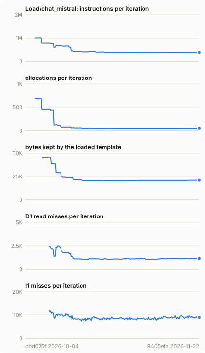
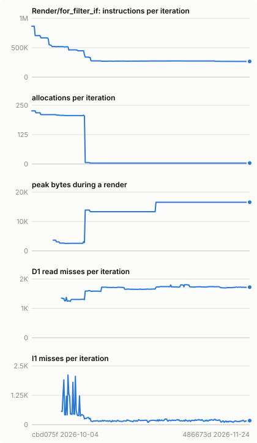
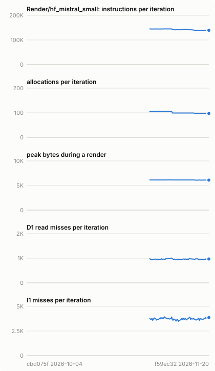

# Benchmark trend

Instruction and allocation counts per iteration on master, one record per commit (226 so far, latest [04795b0](https://github.com/jinja2cpp/Jinja2Cpp/commit/04795b0936a69ad8689f39e78acea5c27245fadd) on 2026-11-15). Written by the `trend` job of `.github/workflows/benchmark.yml` with `bench/trend.py`; the data is `history.jsonl`.

Memory is the bytes a loaded template keeps for `Load/*` and the peak heap use of one render for `Render/*`; vs first compares with the first record that has it.

| Benchmark | Instructions | vs previous | vs first | Allocations | vs previous | vs first | Memory | vs previous | vs first |
|---|---:|---:|---:|---:|---:|---:|---:|---:|---:|
| [Load/chat_llama](#loadchat_llama) | 335,988 | 0% |  | 55 | 0% |  | 18,480 | 0% | -52.71% |
| [Render/chat_llama](#renderchat_llama) | 292,230 | 0% |  | 225 | 0% |  | 11,616 | 0% | -19.11% |
| [Load/chat_mistral](#loadchat_mistral) | 386,177 | 0% |  | 52 | 0% |  | 20,904 | 0% | -53.18% |
| [Render/chat_mistral](#renderchat_mistral) | 494,863 | -0.02% |  | 402 | 0% |  | 9,952 | 0% | -24.65% |
| [Load/chat_qwen](#loadchat_qwen) | 261,852 | 0% |  | 44 | 0% |  | 14,432 | 0% | -47.19% |
| [Render/chat_qwen](#renderchat_qwen) | 273,811 | +0.03% |  | 212 | 0% |  | 8,304 | 0% | -2.35% |
| [Load/config_file](#loadconfig_file) | 94,912 | +0.01% |  | 25 | 0% |  | 5,480 | 0% | -48.11% |
| [Render/config_file](#renderconfig_file) | 1,281,600 | +0.19% |  | 910 | 0% |  | 25,560 | 0% | +7.36% |
| [Load/dict_ops](#loaddict_ops) | 32,527 | +0.02% | -77.99% | 9 | 0% | -93.13% | 2,192 | 0% | -48.50% |
| [Render/dict_ops](#renderdict_ops) | 292,339 | 0% | -57.68% | 112 | 0% | -75.11% | 24,408 | 0% | -29.65% |
| [Load/expressions](#loadexpressions) | 44,486 | +0.01% | -78.42% | 16 | 0% | -89.04% | 2,744 | 0% | -55.28% |
| [Render/expressions](#renderexpressions) | 417,534 | 0% | -53.92% | 3 | 0% | -90.00% | 2,440 | 0% | -31.15% |
| [Load/filters](#loadfilters) | 67,539 | +0.01% | -75.39% | 27 | 0% | -88.16% | 3,864 | 0% | -66.15% |
| [Render/filters](#renderfilters) | 27,008 | -0.02% | -69.54% | 23 | 0% | -68.92% | 752 | 0% | -84.69% |
| [Load/for_filter_if](#loadfor_filter_if) | 29,344 | +0.02% | -78.33% | 7 | 0% | -94.31% | 1,920 | 0% | -44.32% |
| [Render/for_filter_if](#renderfor_filter_if) | 268,882 | 0% | -68.93% | 4 | 0% | -98.23% | 16,560 | 0% | +354.95% |
| [Load/for_loop_vars](#loadfor_loop_vars) | 39,169 | +0.06% | -78.32% | 10 | 0% | -93.63% | 2,384 | 0% | -47.26% |
| [Render/for_loop_vars](#renderfor_loop_vars) | 172,283 | 0% | -83.94% | 2 | 0% | -99.62% | 1,568 | 0% | -43.35% |
| [Load/for_range](#loadfor_range) | 13,368 | +0.04% | -76.42% | 7 | 0% | -87.50% | 1,104 | 0% | -44.80% |
| [Render/for_range](#renderfor_range) | 37,471 | +0.01% | -59.36% | 3 | 0% | -88.89% | 408 | 0% | -73.02% |
| [Load/hf_deepseek_v31](#loadhf_deepseek_v31) | 384,216 | +0.04% |  | 55 | 0% |  | 21,992 | 0% | +0.81% |
| [Render/hf_deepseek_v31](#renderhf_deepseek_v31) | 92,112 | +0.01% |  | 43 | 0% |  | 2,480 | 0% | 0% |
| [Load/hf_gpt_oss](#loadhf_gpt_oss) | 1,524,777 | -0.04% |  | 287 | 0% |  | 74,576 | 0% | +0.47% |
| [Render/hf_gpt_oss](#renderhf_gpt_oss) | 170,144 | +0.19% |  | 156 | 0% |  | 5,664 | 0% | +14.75% |
| [Load/hf_mistral_small](#loadhf_mistral_small) | 592,527 | +0.06% |  | 88 | 0% |  | 33,064 | 0% | +0.39% |
| [Render/hf_mistral_small](#renderhf_mistral_small) | 141,448 | +0.02% |  | 99 | 0% |  | 6,120 | 0% | -0.26% |
| [Load/hf_qwen3](#loadhf_qwen3) | 477,033 | -0.03% |  | 82 | 0% |  | 25,576 | 0% | +0.38% |
| [Render/hf_qwen3](#renderhf_qwen3) | 119,446 | +0.39% |  | 100 | 0% |  | 3,248 | 0% | 0% |
| [Load/html_autoescape](#loadhtml_autoescape) | 190,064 | +0.01% |  | 43 | 0% |  | 12,688 | 0% | -48.59% |
| [Render/html_autoescape](#renderhtml_autoescape) | 1,200,195 | +0.02% |  | 675 | 0% |  | 45,992 | 0% | +13.89% |
| [Load/inheritance](#loadinheritance) | 21,978 | +0.02% | -80.74% | 7 | 0% | -93.46% | 1,360 | 0% | -52.65% |
| [Render/inheritance](#renderinheritance) | 138,365 | +0.09% | -81.50% | 38 | 0% | -93.89% | 7,920 | 0% | +31.65% |
| [Load/int_arith](#loadint_arith) | 65,431 | -0.01% |  | 20 | 0% |  | 3,888 | 0% | +0.83% |
| [Render/int_arith](#renderint_arith) | 831,759 | 0% |  | 12 | 0% |  | 3,272 | 0% | -0.49% |
| [Module/keep](#modulekeep) | 7,192 | -0.15% |  | 7 | 0% |  |  |  |  |
| [Module/keep_written](#modulekeep_written) | 29,252 | -0.04% |  | 11 | 0% |  |  |  |  |
| [Load/large_static](#loadlarge_static) | 147,997 | 0% | -83.30% | 14 | 0% | -96.82% | 43,136 | 0% | -19.20% |
| [Render/large_static](#renderlarge_static) | 20,753 | +0.01% | -72.38% | 1 | 0% | -94.44% | 36,552 | 0% | -1.83% |
| [RenderSink/large_static](#rendersinklarge_static) | 12,743 | +0.02% |  | 0 |  |  | 0 |  |  |
| [RenderTo/large_static](#rendertolarge_static) | 20,316 | +0.01% |  | 0 |  |  | 0 |  |  |
| [Load/macros](#loadmacros) | 55,021 | -0.01% | -75.86% | 27 | 0% | -85.48% | 4,392 | 0% | -29.34% |
| [Render/macros](#rendermacros) | 644,966 | +0.11% | -74.84% | 308 | 0% | -88.71% | 20,576 | 0% | +39.78% |
| [Load/many_tags](#loadmany_tags) | 8,766,010 | +0.01% | -80.15% | 951 | 0% | -97.22% | 438,128 | -0.01% | -58.48% |
| [Render/many_tags](#rendermany_tags) | 740,308 | -0.15% | -64.46% | 2 | 0% | -90.48% | 5,648 | 0% | -10.52% |
| [Load/mitsuhiko_table](#loadmitsuhiko_table) | 45,372 | +0.05% | -80.90% | 19 | 0% | -89.67% | 3,376 | 0% | -44.33% |
| [Render/mitsuhiko_table](#rendermitsuhiko_table) | 5,154,057 | -0.01% | -58.29% | 33 | 0% | -99.19% | 381,536 | 0% | +9.95% |
| [RenderSink/mitsuhiko_table](#rendersinkmitsuhiko_table) | 5,081,030 | -0.01% |  | 32 | 0% |  | 37,064 | 0% | +28.59% |
| [RenderTo/mitsuhiko_table](#rendertomitsuhiko_table) | 5,153,544 | 0% |  | 32 | 0% |  | 37,064 | 0% | +28.59% |
| [Load/mitsuhiko_table_wide](#loadmitsuhiko_table_wide) | 53,060 | +0.01% |  | 35 | 0% |  | 5,704 | 0% | -30.98% |
| [Render/mitsuhiko_table_wide](#rendermitsuhiko_table_wide) | 5,499,865 | 0% |  | 33 | 0% |  | 1,414,928 | 0% | +2.46% |
| [RenderSink/mitsuhiko_table_wide](#rendersinkmitsuhiko_table_wide) | 5,323,089 | 0% |  | 32 | 0% |  | 37,064 | 0% | +28.59% |
| [RenderTo/mitsuhiko_table_wide](#rendertomitsuhiko_table_wide) | 5,499,334 | 0% |  | 32 | 0% |  | 37,064 | 0% | +28.59% |
| [Load/plain_text](#loadplain_text) | 3,757 | +0.13% | -61.17% | 4 | 0% | -77.78% | 688 | 0% | -38.57% |
| [Render/plain_text](#renderplain_text) | 1,058 | +0.28% | -84.43% | 1 | 0% | -91.67% | 40 | 0% | -94.44% |
| [RenderSink/plain_text](#rendersinkplain_text) | 760 | +0.40% |  | 0 |  |  | 0 |  |  |
| [RenderTo/plain_text](#rendertoplain_text) | 859 | +0.35% |  | 0 |  |  | 0 |  |  |
| [Load/prompt_budget](#loadprompt_budget) | 34,647 | +0.01% |  | 18 | 0% |  | 2,240 | 0% | +0.72% |
| [Render/prompt_budget](#renderprompt_budget) | 1,319,827 | 0% |  | 76 | 0% |  | 36,416 | 0% | 0% |
| [Load/strings](#loadstrings) | 69,422 | +0.03% | -76.21% | 30 | 0% | -86.61% | 4,360 | 0% | -51.77% |
| [Render/strings](#renderstrings) | 582,944 | 0% | -72.21% | 344 | 0% | -83.73% | 9,088 | 0% | -49.31% |
| [Load/substitute](#loadsubstitute) | 7,537 | +0.07% | -74.76% | 6 | 0% | -83.78% | 848 | 0% | -44.21% |
| [Render/substitute](#rendersubstitute) | 2,257 | +0.13% | -74.39% | 1 | 0% | -91.67% | 40 | 0% | -94.44% |
| [RenderSink/substitute](#rendersinksubstitute) | 1,963 | +0.15% |  | 0 |  |  | 0 |  |  |
| [RenderTo/substitute](#rendertosubstitute) | 2,062 | +0.15% |  | 0 |  |  | 0 |  |  |

## Cache misses

Misses per iteration in callgrind's cache model (`count.py --cache-sim`: 32 KB 8-way L1, 8 MB 16-way last level, no prefetcher); reported, not gated.

| Benchmark | D1 read misses | vs previous | D1 write misses | vs previous | LL data read misses | vs previous | I1 misses | vs previous |
|---|---:|---:|---:|---:|---:|---:|---:|---:|
| Load/chat_llama | 764 | +1.19% | 761 | +0.53% | 0 |  | 8,196 | +4.08% |
| Render/chat_llama | 1,228 | +2.50% | 533 | -1.11% | 0 |  | 4,179 | -2.77% |
| Load/chat_mistral | 1,115 | +2.01% | 1,088 | +0.93% | 0 |  | 9,591 | +5.76% |
| Render/chat_mistral | 1,956 | +1.98% | 597 | -0.83% | 0 |  | 10,282 | -2.15% |
| Load/chat_qwen | 580 | +0.87% | 632 | +0.48% | 0 |  | 5,367 | +5.69% |
| Render/chat_qwen | 1,075 | -0.65% | 414 | +0.49% | 0 |  | 3,593 | -0.53% |
| Load/config_file | 224 | +1.36% | 184 | +2.22% | 0 |  | 2,998 | +5.90% |
| Render/config_file | 6,869 | +10.22% | 1,757 | +7.53% | 0 |  | 45,370 | +4.35% |
| Load/dict_ops | 51 | +15.91% | 30 | +20.00% | 0 |  | 1,386 | -1.35% |
| Render/dict_ops | 671 | 0% | 427 | +0.95% | 0 |  | 836 | -1.18% |
| Load/expressions | 36 | +44.00% | 28 | +21.74% | 0 |  | 1,367 | -1.44% |
| Render/expressions | 4 | 0% | 1 | -50.00% | 0 |  | 349 | +7.38% |
| Load/filters | 109 | +4.81% | 49 | +2.08% | 0 |  | 1,657 | +9.30% |
| Render/filters | 10 | 0% | 2 | +100.00% | 0 |  | 782 | -1.26% |
| Load/for_filter_if | 29 | +16.00% | 13 | +8.33% | 0 |  | 1,173 | +2.18% |
| Render/for_filter_if | 1,740 | +0.23% | 138 | +0.73% | 0 |  | 198 | +6.45% |
| Load/for_loop_vars | 50 | +8.70% | 23 | +9.52% | 0 |  | 1,263 | +8.04% |
| Render/for_loop_vars | 4 | -55.56% | 1 | 0% | 0 |  | 144 | +17.07% |
| Load/for_range | 9 | +80.00% | 5 | +25.00% | 0 |  | 787 | -0.25% |
| Render/for_range | 2 | +100.00% | 0 |  | 0 |  | 160 | +9.59% |
| Load/hf_deepseek_v31 | 1,049 | +3.35% | 981 | -0.61% | 0 |  | 7,542 | +9.83% |
| Render/hf_deepseek_v31 | 375 | -1.06% | 94 | +2.17% | 0 |  | 1,412 | -10.12% |
| Load/hf_gpt_oss | 4,661 | +0.22% | 3,375 | +0.18% | 0 |  | 25,844 | +8.48% |
| Render/hf_gpt_oss | 1,262 | +0.88% | 401 | 0% | 0 |  | 4,735 | -0.25% |
| Load/hf_mistral_small | 1,923 | +2.61% | 1,651 | +0.98% | 0 |  | 12,521 | +5.55% |
| Render/hf_mistral_small | 973 | -1.62% | 301 | +1.69% | 0 |  | 3,679 | -6.15% |
| Load/hf_qwen3 | 1,502 | -1.89% | 1,346 | +0.22% | 0 |  | 10,285 | +7.29% |
| Render/hf_qwen3 | 702 | +0.57% | 223 | +4.69% | 0 |  | 2,695 | -0.88% |
| Load/html_autoescape | 509 | +3.46% | 539 | +0.75% | 0 |  | 4,826 | +9.01% |
| Render/html_autoescape | 4,941 | +7.58% | 1,284 | -10.08% | 0 |  | 37,270 | +2.91% |
| Load/inheritance | 5 | 0% | 3 | 0% | 0 |  | 761 | +4.39% |
| Render/inheritance | 601 | -0.66% | 111 | -2.63% | 0 |  | 972 | -1.42% |
| Load/int_arith | 85 | +21.43% | 65 | +14.04% | 0 |  | 2,141 | -2.01% |
| Render/int_arith | 10 | +42.86% | 5 | +25.00% | 0 |  | 746 | -7.21% |
| Module/keep | 1 | 0% | 3 | 0% | 0 |  | 462 | +19.69% |
| Module/keep_written | 1,137 | +0.26% | 560 | -0.18% | 0 |  | 766 | +5.08% |
| Load/large_static | 1,928 | 0% | 905 | +0.11% | 0 |  | 331 | -5.16% |
| Render/large_static | 707 | 0% | 576 | -0.17% | 0 |  | 5 | -16.67% |
| RenderSink/large_static | 1 | 0% | 0 |  | 0 |  | 4 | +33.33% |
| RenderTo/large_static | 684 | -0.29% | 578 | +0.35% | 0 |  | 5 | -16.67% |
| Load/macros | 96 | +6.67% | 86 | +14.67% | 0 |  | 1,784 | +2.35% |
| Render/macros | 783 | +0.38% | 260 | -5.80% | 0 |  | 1,242 | +103.94% |
| Load/many_tags | 29,893 | +4.41% | 22,713 | +0.53% | 0 |  | 248,834 | +1.42% |
| Render/many_tags | 6,136 | -0.31% | 800 | +4.03% | 0 |  | 106 | -15.87% |
| Load/mitsuhiko_table | 39 | -7.14% | 48 | -5.88% | 0 |  | 899 | -2.92% |
| Render/mitsuhiko_table | 10,039 | -0.17% | 6,254 | -0.10% | 0 |  | 391 | +5.96% |
| RenderSink/mitsuhiko_table | 9,989 | +0.01% | 1,198 | -0.33% | 0 |  | 346 | +15.72% |
| RenderTo/mitsuhiko_table | 10,050 | +0.01% | 6,264 | +0.02% | 0 |  | 378 | +10.20% |
| Load/mitsuhiko_table_wide | 87 | -6.45% | 75 | -6.25% | 0 |  | 980 | -11.79% |
| Render/mitsuhiko_table_wide | 10,209 | +0.22% | 22,686 | 0% | 0 |  | 394 | +8.24% |
| RenderSink/mitsuhiko_table_wide | 10,035 | +0.15% | 1,297 | +0.46% | 0 |  | 355 | +18.33% |
| RenderTo/mitsuhiko_table_wide | 10,226 | -0.01% | 22,689 | +0.01% | 0 |  | 386 | +13.53% |
| Load/plain_text | 0 |  | 2 | 0% | 0 |  | 50 | +733.33% |
| Render/plain_text | 1 | 0% | 0 |  | 0 |  | 6 | 0% |
| RenderSink/plain_text | 1 | 0% | 0 |  | 0 |  | 6 | +20.00% |
| RenderTo/plain_text | 1 | 0% | 0 |  | 0 |  | 6 | 0% |
| Load/prompt_budget | 90 | +15.38% | 45 | +7.14% | 0 |  | 1,436 | +0.70% |
| Render/prompt_budget | 4,814 | +0.23% | 555 | -0.36% | 0 |  | 912 | -0.98% |
| Load/strings | 144 | +2.13% | 110 | +3.77% | 0 |  | 2,815 | +2.66% |
| Render/strings | 416 | +1.22% | 474 | +1.07% | 0 |  | 1,598 | -0.31% |
| Load/substitute | 3 | -25.00% | 4 | 0% | 0 |  | 226 | +26.97% |
| Render/substitute | 1 | 0% | 0 |  | 0 |  | 4 | -33.33% |
| RenderSink/substitute | 0 | -100.00% | 0 |  | 0 |  | 4 | 0% |
| RenderTo/substitute | 1 | 0% | 0 |  | 0 |  | 5 | -16.67% |

## Charts

### Load/chat_llama

### Render/chat_llama

### Load/chat_mistral

### Render/chat_mistral

### Load/chat_qwen

### Render/chat_qwen

### Load/config_file

### Render/config_file

### Load/dict_ops

### Render/dict_ops

### Load/expressions

### Render/expressions

### Load/filters

### Render/filters

### Load/for_filter_if

### Render/for_filter_if

### Load/for_loop_vars

### Render/for_loop_vars

### Load/for_range

### Render/for_range

### Load/hf_deepseek_v31

### Render/hf_deepseek_v31

### Load/hf_gpt_oss

### Render/hf_gpt_oss

### Load/hf_mistral_small

### Render/hf_mistral_small

### Load/hf_qwen3

### Render/hf_qwen3

### Load/html_autoescape

### Render/html_autoescape

### Load/inheritance

### Render/inheritance

### Load/int_arith

### Render/int_arith

### Module/keep

### Module/keep_written

### Load/large_static

### Render/large_static

### RenderSink/large_static

### RenderTo/large_static

### Load/macros

### Render/macros

### Load/many_tags

### Render/many_tags

### Load/mitsuhiko_table

### Render/mitsuhiko_table

### RenderSink/mitsuhiko_table

### RenderTo/mitsuhiko_table

### Load/mitsuhiko_table_wide

### Render/mitsuhiko_table_wide

### RenderSink/mitsuhiko_table_wide

### RenderTo/mitsuhiko_table_wide

### Load/plain_text

### Render/plain_text

### RenderSink/plain_text

### RenderTo/plain_text

### Load/prompt_budget

### Render/prompt_budget

### Load/strings

### Render/strings

### Load/substitute

### Render/substitute

### RenderSink/substitute

### RenderTo/substitute

