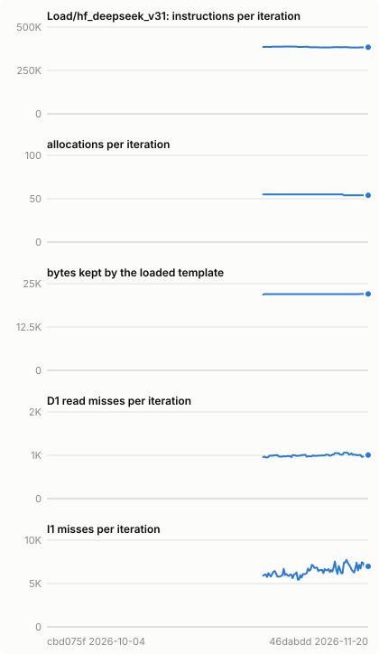
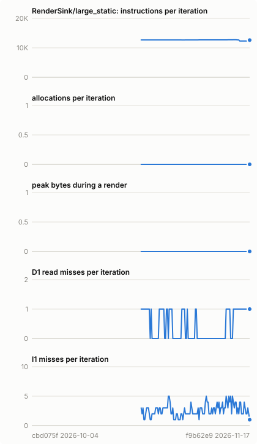
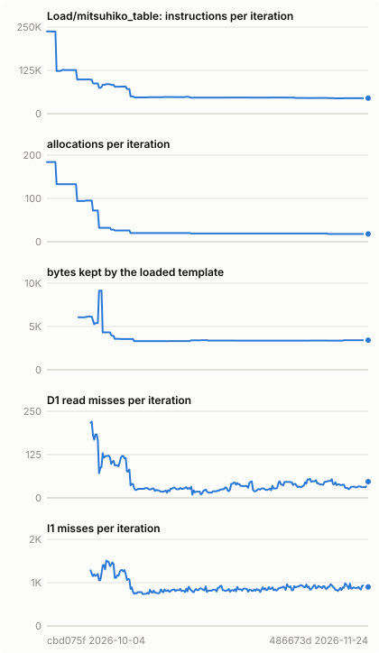
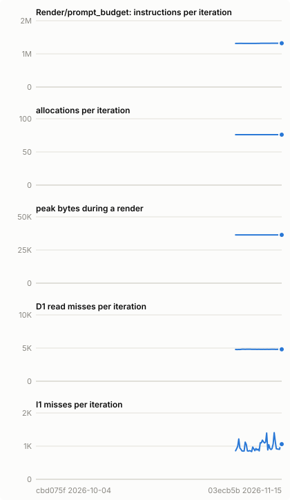

# Benchmark trend

Instruction and allocation counts per iteration on master, one record per commit (233 so far, latest [37c378c](https://github.com/jinja2cpp/Jinja2Cpp/commit/37c378cb2a1f9c11751212aa75d500fb89de9483) on 2026-11-16). Written by the `trend` job of `.github/workflows/benchmark.yml` with `bench/trend.py`; the data is `history.jsonl`.

Memory is the bytes a loaded template keeps for `Load/*` and the peak heap use of one render for `Render/*`; vs first compares with the first record that has it.

| Benchmark | Instructions | vs previous | vs first | Allocations | vs previous | vs first | Memory | vs previous | vs first |
|---|---:|---:|---:|---:|---:|---:|---:|---:|---:|
| [Load/chat_llama](#loadchat_llama) | 335,524 | -0.10% |  | 54 | -1.82% |  | 18,472 | -0.04% | -52.73% |
| [Render/chat_llama](#renderchat_llama) | 288,957 | -0.07% |  | 224 | 0% |  | 11,592 | 0% | -19.28% |
| [Load/chat_mistral](#loadchat_mistral) | 385,600 | -0.09% |  | 51 | -1.92% |  | 20,896 | -0.04% | -53.20% |
| [Render/chat_mistral](#renderchat_mistral) | 491,311 | -0.05% |  | 401 | 0% |  | 9,992 | +0.32% | -24.35% |
| [Load/chat_qwen](#loadchat_qwen) | 261,340 | -0.16% |  | 43 | -2.27% |  | 14,424 | -0.06% | -47.22% |
| [Render/chat_qwen](#renderchat_qwen) | 271,745 | -0.01% |  | 211 | 0% |  | 8,280 | 0% | -2.63% |
| [Load/config_file](#loadconfig_file) | 94,414 | -0.44% |  | 24 | -4.00% |  | 5,472 | -0.15% | -48.18% |
| [Render/config_file](#renderconfig_file) | 1,269,268 | 0% |  | 908 | 0% |  | 25,576 | 0% | +7.43% |
| [Load/dict_ops](#loaddict_ops) | 32,040 | -1.28% | -78.32% | 8 | -11.11% | -93.89% | 2,184 | -0.36% | -48.68% |
| [Render/dict_ops](#renderdict_ops) | 290,581 | -0.01% | -57.94% | 112 | 0% | -75.11% | 24,408 | 0% | -29.65% |
| [Load/expressions](#loadexpressions) | 44,017 | -0.95% | -78.65% | 15 | -6.25% | -89.73% | 2,736 | -0.29% | -55.41% |
| [Render/expressions](#renderexpressions) | 415,881 | 0% | -54.10% | 3 | 0% | -90.00% | 2,440 | 0% | -31.15% |
| [Load/filters](#loadfilters) | 67,165 | -0.56% | -75.53% | 26 | -3.70% | -88.60% | 3,856 | -0.21% | -66.22% |
| [Render/filters](#renderfilters) | 26,383 | +0.03% | -70.25% | 23 | 0% | -68.92% | 752 | 0% | -84.69% |
| [Load/for_filter_if](#loadfor_filter_if) | 28,875 | -1.44% | -78.67% | 6 | -14.29% | -95.12% | 1,912 | -0.42% | -44.55% |
| [Render/for_filter_if](#renderfor_filter_if) | 267,465 | 0% | -69.10% | 4 | 0% | -98.23% | 16,560 | 0% | +354.95% |
| [Load/for_loop_vars](#loadfor_loop_vars) | 38,728 | -1.01% | -78.56% | 9 | -10.00% | -94.27% | 2,376 | -0.34% | -47.43% |
| [Render/for_loop_vars](#renderfor_loop_vars) | 170,711 | 0% | -84.09% | 2 | 0% | -99.62% | 1,568 | 0% | -43.35% |
| [Load/for_range](#loadfor_range) | 12,931 | -3.17% | -77.19% | 6 | -14.29% | -89.29% | 1,096 | -0.72% | -45.20% |
| [Render/for_range](#renderfor_range) | 37,116 | 0% | -59.75% | 3 | 0% | -88.89% | 408 | 0% | -73.02% |
| [Load/hf_deepseek_v31](#loadhf_deepseek_v31) | 384,412 | +0.10% |  | 54 | -1.82% |  | 21,984 | -0.04% | +0.77% |
| [Render/hf_deepseek_v31](#renderhf_deepseek_v31) | 90,167 | +0.01% |  | 42 | 0% |  | 2,456 | 0% | -0.97% |
| [Load/hf_gpt_oss](#loadhf_gpt_oss) | 1,523,483 | +0.02% |  | 282 | -0.35% |  | 74,776 | +0.03% | +0.74% |
| [Render/hf_gpt_oss](#renderhf_gpt_oss) | 167,413 | +0.01% |  | 154 | 0% |  | 5,664 | 0% | +14.75% |
| [Load/hf_mistral_small](#loadhf_mistral_small) | 592,078 | -0.04% |  | 87 | -1.14% |  | 33,072 | +0.02% | +0.41% |
| [Render/hf_mistral_small](#renderhf_mistral_small) | 139,154 | +0.06% |  | 98 | 0% |  | 6,096 | -0.26% | -0.65% |
| [Load/hf_qwen3](#loadhf_qwen3) | 476,840 | -0.01% |  | 81 | -1.22% |  | 25,568 | -0.03% | +0.35% |
| [Render/hf_qwen3](#renderhf_qwen3) | 116,675 | +0.11% |  | 99 | 0% |  | 3,224 | 0% | -0.74% |
| [Load/html_autoescape](#loadhtml_autoescape) | 189,482 | -0.22% |  | 42 | -2.33% |  | 12,680 | -0.06% | -48.62% |
| [Render/html_autoescape](#renderhtml_autoescape) | 1,195,481 | -0.04% |  | 674 | 0% |  | 45,968 | 0% | +13.83% |
| [Load/inheritance](#loadinheritance) | 21,544 | -1.92% | -81.12% | 6 | -14.29% | -94.39% | 1,352 | -0.59% | -52.92% |
| [Render/inheritance](#renderinheritance) | 134,126 | -0.10% | -82.07% | 35 | 0% | -94.37% | 7,960 | 0% | +32.31% |
| [Load/int_arith](#loadint_arith) | 64,949 | -0.66% |  | 19 | -5.00% |  | 3,880 | -0.21% | +0.62% |
| [Render/int_arith](#renderint_arith) | 827,334 | 0% |  | 12 | 0% |  | 3,272 | 0% | -0.49% |
| [Module/keep](#modulekeep) | 7,127 | 0% |  | 7 | 0% |  |  |  |  |
| [Module/keep_written](#modulekeep_written) | 29,266 | 0% |  | 11 | 0% |  |  |  |  |
| [Load/large_static](#loadlarge_static) | 147,594 | -0.27% | -83.34% | 13 | -7.14% | -97.05% | 43,128 | -0.02% | -19.21% |
| [Render/large_static](#renderlarge_static) | 20,322 | 0% | -72.95% | 1 | 0% | -94.44% | 36,552 | 0% | -1.83% |
| [RenderSink/large_static](#rendersinklarge_static) | 12,310 | 0% |  | 0 |  |  | 0 |  |  |
| [RenderTo/large_static](#rendertolarge_static) | 19,885 | 0% |  | 0 |  |  | 0 |  |  |
| [Load/macros](#loadmacros) | 54,689 | -0.21% | -76.01% | 25 | -3.85% | -86.56% | 4,424 | -0.18% | -28.83% |
| [Render/macros](#rendermacros) | 640,899 | -0.03% | -74.99% | 308 | 0% | -88.71% | 20,576 | 0% | +39.78% |
| [Load/many_tags](#loadmany_tags) | 8,764,284 | 0% | -80.16% | 950 | -0.11% | -97.23% | 438,120 | 0% | -58.48% |
| [Render/many_tags](#rendermany_tags) | 730,177 | 0% | -64.95% | 2 | 0% | -90.48% | 5,648 | 0% | -10.52% |
| [Load/mitsuhiko_table](#loadmitsuhiko_table) | 44,868 | -0.93% | -81.11% | 18 | -5.26% | -90.22% | 3,368 | -0.24% | -44.46% |
| [Render/mitsuhiko_table](#rendermitsuhiko_table) | 5,138,274 | 0% | -58.42% | 33 | 0% | -99.19% | 381,536 | 0% | +9.95% |
| [RenderSink/mitsuhiko_table](#rendersinkmitsuhiko_table) | 5,065,415 | 0% |  | 32 | 0% |  | 37,064 | 0% | +28.59% |
| [RenderTo/mitsuhiko_table](#rendertomitsuhiko_table) | 5,137,780 | 0% |  | 32 | 0% |  | 37,064 | 0% | +28.59% |
| [Load/mitsuhiko_table_wide](#loadmitsuhiko_table_wide) | 52,588 | -0.74% |  | 34 | -2.86% |  | 5,696 | -0.14% | -31.07% |
| [Render/mitsuhiko_table_wide](#rendermitsuhiko_table_wide) | 5,484,685 | +0.01% |  | 33 | 0% |  | 1,414,928 | 0% | +2.46% |
| [RenderSink/mitsuhiko_table_wide](#rendersinkmitsuhiko_table_wide) | 5,307,857 | +0.01% |  | 32 | 0% |  | 37,064 | 0% | +28.59% |
| [RenderTo/mitsuhiko_table_wide](#rendertomitsuhiko_table_wide) | 5,484,104 | +0.01% |  | 32 | 0% |  | 37,064 | 0% | +28.59% |
| [Load/plain_text](#loadplain_text) | 3,338 | -11.22% | -65.50% | 3 | -25.00% | -83.33% | 680 | -1.16% | -39.29% |
| [Render/plain_text](#renderplain_text) | 951 | 0% | -86.00% | 1 | 0% | -91.67% | 40 | 0% | -94.44% |
| [RenderSink/plain_text](#rendersinkplain_text) | 651 | 0% |  | 0 |  |  | 0 |  |  |
| [RenderTo/plain_text](#rendertoplain_text) | 752 | 0% |  | 0 |  |  | 0 |  |  |
| [Load/prompt_budget](#loadprompt_budget) | 34,212 | -1.22% |  | 17 | -5.56% |  | 2,232 | -0.36% | +0.36% |
| [Render/prompt_budget](#renderprompt_budget) | 1,319,323 | 0% |  | 76 | 0% |  | 36,416 | 0% | 0% |
| [Load/strings](#loadstrings) | 68,998 | -0.52% | -76.36% | 29 | -3.33% | -87.05% | 4,352 | -0.18% | -51.86% |
| [Render/strings](#renderstrings) | 580,576 | -0.03% | -72.32% | 344 | 0% | -83.73% | 9,088 | 0% | -49.31% |
| [Load/substitute](#loadsubstitute) | 7,118 | -5.60% | -76.16% | 5 | -16.67% | -86.49% | 840 | -0.94% | -44.74% |
| [Render/substitute](#rendersubstitute) | 1,631 | 0% | -81.49% | 1 | 0% | -91.67% | 40 | 0% | -94.44% |
| [RenderSink/substitute](#rendersinksubstitute) | 1,335 | 0% |  | 0 |  |  | 0 |  |  |
| [RenderTo/substitute](#rendertosubstitute) | 1,436 | 0% |  | 0 |  |  | 0 |  |  |

## Cache misses

Misses per iteration in callgrind's cache model (`count.py --cache-sim`: 32 KB 8-way L1, 8 MB 16-way last level, no prefetcher); reported, not gated.

| Benchmark | D1 read misses | vs previous | D1 write misses | vs previous | LL data read misses | vs previous | I1 misses | vs previous |
|---|---:|---:|---:|---:|---:|---:|---:|---:|
| Load/chat_llama | 735 | +0.55% | 748 | -0.66% | 0 |  | 8,043 | +6.87% |
| Render/chat_llama | 1,162 | -0.43% | 522 | -0.38% | 0 |  | 4,093 | +4.60% |
| Load/chat_mistral | 1,083 | -0.91% | 1,073 | -0.09% | 0 |  | 9,458 | +12.81% |
| Render/chat_mistral | 1,916 | +1.05% | 584 | -4.26% | 0 |  | 10,255 | +1.77% |
| Load/chat_qwen | 565 | -0.18% | 627 | -0.16% | 0 |  | 5,061 | +12.74% |
| Render/chat_qwen | 1,086 | +0.65% | 424 | -4.50% | 0 |  | 3,450 | -0.26% |
| Load/config_file | 222 | +0.91% | 189 | +2.16% | 0 |  | 2,806 | +2.30% |
| Render/config_file | 5,922 | +0.59% | 1,607 | -0.99% | 0 |  | 44,405 | +0.66% |
| Load/dict_ops | 46 | -11.54% | 26 | -7.14% | 0 |  | 1,384 | +3.67% |
| Render/dict_ops | 669 | +1.21% | 419 | -1.87% | 0 |  | 827 | +4.16% |
| Load/expressions | 46 | +31.43% | 32 | +18.52% | 0 |  | 1,309 | +0.93% |
| Render/expressions | 9 | +200.00% | 4 | +300.00% | 0 |  | 294 | +7.30% |
| Load/filters | 101 | -8.18% | 47 | -4.08% | 0 |  | 1,607 | -7.91% |
| Render/filters | 9 | 0% | 0 |  | 0 |  | 740 | -0.40% |
| Load/for_filter_if | 34 | +30.77% | 18 | +28.57% | 0 |  | 1,157 | +9.88% |
| Render/for_filter_if | 1,701 | -0.18% | 90 | +7.14% | 0 |  | 157 | +40.18% |
| Load/for_loop_vars | 48 | +2.13% | 26 | +23.81% | 0 |  | 1,162 | +4.78% |
| Render/for_loop_vars | 11 | +57.14% | 2 | 0% | 0 |  | 125 | +28.87% |
| Load/for_range | 3 | -25.00% | 5 | +25.00% | 0 |  | 753 | -0.79% |
| Render/for_range | 1 | 0% | 0 |  | 0 |  | 106 | -7.02% |
| Load/hf_deepseek_v31 | 1,061 | +4.64% | 1,003 | +3.08% | 0 |  | 7,419 | +19.87% |
| Render/hf_deepseek_v31 | 330 | -1.20% | 79 | +2.60% | 0 |  | 1,440 | -4.57% |
| Load/hf_gpt_oss | 4,631 | -1.32% | 3,347 | -0.83% | 0 |  | 25,012 | +13.46% |
| Render/hf_gpt_oss | 1,250 | +0.48% | 403 | +1.77% | 0 |  | 4,579 | -2.78% |
| Load/hf_mistral_small | 1,912 | +1.11% | 1,657 | +0.61% | 0 |  | 12,371 | +12.41% |
| Render/hf_mistral_small | 978 | +2.19% | 288 | -0.35% | 0 |  | 3,623 | -1.36% |
| Load/hf_qwen3 | 1,524 | +2.35% | 1,347 | +0.67% | 0 |  | 10,010 | +13.30% |
| Render/hf_qwen3 | 676 | +1.05% | 219 | +2.34% | 0 |  | 2,635 | -1.16% |
| Load/html_autoescape | 478 | -4.02% | 534 | -0.93% | 0 |  | 4,254 | +6.01% |
| Render/html_autoescape | 5,456 | +18.82% | 1,772 | +27.39% | 0 |  | 35,853 | -7.85% |
| Load/inheritance | 8 | 0% | 4 | -20.00% | 0 |  | 715 | +2.14% |
| Render/inheritance | 596 | +1.02% | 109 | +0.93% | 0 |  | 941 | -1.67% |
| Load/int_arith | 90 | +23.29% | 64 | +14.29% | 0 |  | 2,060 | +1.58% |
| Render/int_arith | 8 | +33.33% | 3 | 0% | 0 |  | 724 | -73.46% |
| Module/keep | 2 | 0% | 2 | 0% | 0 |  | 403 | -2.66% |
| Module/keep_written | 1,133 | +0.09% | 563 | -0.18% | 0 |  | 758 | -1.94% |
| Load/large_static | 1,927 | 0% | 907 | +0.22% | 0 |  | 273 | -9.90% |
| Render/large_static | 702 | +0.29% | 569 | -0.18% | 0 |  | 4 | -33.33% |
| RenderSink/large_static | 1 | 0% | 0 |  | 0 |  | 2 | -50.00% |
| RenderTo/large_static | 678 | +0.15% | 572 | +0.18% | 0 |  | 4 | -20.00% |
| Load/macros | 85 | +6.25% | 70 | +4.48% | 0 |  | 1,760 | +2.44% |
| Render/macros | 752 | +0.13% | 247 | 0% | 0 |  | 950 | -62.24% |
| Load/many_tags | 27,811 | -2.16% | 22,621 | +0.13% | 0 |  | 250,183 | +3.34% |
| Render/many_tags | 6,096 | +0.02% | 755 | +0.13% | 0 |  | 79 | -17.71% |
| Load/mitsuhiko_table | 49 | +4.26% | 48 | -5.88% | 0 |  | 906 | +5.47% |
| Render/mitsuhiko_table | 10,026 | +0.19% | 6,306 | -0.06% | 0 |  | 325 | +7.26% |
| RenderSink/mitsuhiko_table | 9,967 | -0.16% | 1,209 | -0.41% | 0 |  | 266 | +7.69% |
| RenderTo/mitsuhiko_table | 10,040 | +0.15% | 6,308 | -0.05% | 0 |  | 313 | +13.82% |
| Load/mitsuhiko_table_wide | 98 | +20.99% | 94 | +22.08% | 0 |  | 959 | -5.98% |
| Render/mitsuhiko_table_wide | 10,254 | +0.29% | 22,740 | +0.30% | 0 |  | 323 | +1.57% |
| RenderSink/mitsuhiko_table_wide | 10,062 | +0.23% | 1,325 | +1.84% | 0 |  | 257 | -2.65% |
| RenderTo/mitsuhiko_table_wide | 10,254 | +0.26% | 22,733 | +0.21% | 0 |  | 295 | +4.24% |
| Load/plain_text | 0 |  | 2 | 0% | 0 |  | 36 | +24.14% |
| Render/plain_text | 1 | 0% | 0 |  | 0 |  | 5 | 0% |
| RenderSink/plain_text | 1 | 0% | 0 |  | 0 |  | 3 | -40.00% |
| RenderTo/plain_text | 1 | 0% | 0 |  | 0 |  | 4 | 0% |
| Load/prompt_budget | 81 | -1.22% | 49 | +13.95% | 0 |  | 1,393 | -2.31% |
| Render/prompt_budget | 4,790 | -0.06% | 543 | -0.37% | 0 |  | 1,005 | +16.05% |
| Load/strings | 159 | +16.06% | 128 | +16.36% | 0 |  | 2,791 | +0.87% |
| Render/strings | 400 | +0.25% | 463 | +0.87% | 0 |  | 1,579 | -51.49% |
| Load/substitute | 2 | 0% | 3 | 0% | 0 |  | 123 | -44.09% |
| Render/substitute | 1 | 0% | 0 |  | 0 |  | 4 | -20.00% |
| RenderSink/substitute | 0 | -100.00% | 0 |  | 0 |  | 3 | -25.00% |
| RenderTo/substitute | 1 | 0% | 0 |  | 0 |  | 3 | -40.00% |

## Charts

### Load/chat_llama

### Render/chat_llama

### Load/chat_mistral

### Render/chat_mistral

### Load/chat_qwen

### Render/chat_qwen

### Load/config_file

### Render/config_file

### Load/dict_ops

### Render/dict_ops

### Load/expressions

### Render/expressions

### Load/filters

### Render/filters

### Load/for_filter_if

### Render/for_filter_if

### Load/for_loop_vars

### Render/for_loop_vars

### Load/for_range

### Render/for_range

### Load/hf_deepseek_v31

### Render/hf_deepseek_v31

### Load/hf_gpt_oss

### Render/hf_gpt_oss

### Load/hf_mistral_small

### Render/hf_mistral_small

### Load/hf_qwen3

### Render/hf_qwen3

### Load/html_autoescape

### Render/html_autoescape

### Load/inheritance

### Render/inheritance

### Load/int_arith

### Render/int_arith

### Module/keep

### Module/keep_written

### Load/large_static

### Render/large_static

### RenderSink/large_static

### RenderTo/large_static

### Load/macros

### Render/macros

### Load/many_tags

### Render/many_tags

### Load/mitsuhiko_table

### Render/mitsuhiko_table

### RenderSink/mitsuhiko_table

### RenderTo/mitsuhiko_table

### Load/mitsuhiko_table_wide

### Render/mitsuhiko_table_wide

### RenderSink/mitsuhiko_table_wide

### RenderTo/mitsuhiko_table_wide

### Load/plain_text

### Render/plain_text

### RenderSink/plain_text

### RenderTo/plain_text

### Load/prompt_budget

### Render/prompt_budget

### Load/strings

### Render/strings

### Load/substitute

### Render/substitute

### RenderSink/substitute

### RenderTo/substitute

