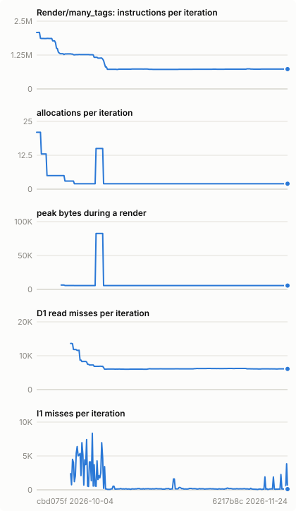

# Benchmark trend

Instruction and allocation counts per iteration on master, one record per commit (255 so far, latest [4d065ab](https://github.com/jinja2cpp/Jinja2Cpp/commit/4d065ab0f5d2278b426e75bb6487a91e7939ddf6) on 2026-11-20). Written by the `trend` job of `.github/workflows/benchmark.yml` with `bench/trend.py`; the data is `history.jsonl`.

Memory is the bytes a loaded template keeps for `Load/*` and the peak heap use of one render for `Render/*`; vs first compares with the first record that has it.

| Benchmark | Instructions | vs previous | vs first | Allocations | vs previous | vs first | Memory | vs previous | vs first |
|---|---:|---:|---:|---:|---:|---:|---:|---:|---:|
| [Load/chat_llama](#loadchat_llama) | 336,280 | 0% |  | 54 | 0% |  | 18,520 | 0% | -52.61% |
| [Render/chat_llama](#renderchat_llama) | 290,729 | 0% |  | 224 | 0% |  | 11,592 | 0% | -19.28% |
| [Load/chat_mistral](#loadchat_mistral) | 385,143 | 0% |  | 51 | 0% |  | 20,976 | 0% | -53.02% |
| [Render/chat_mistral](#renderchat_mistral) | 491,129 | 0% |  | 392 | 0% |  | 9,784 | 0% | -25.92% |
| [Load/chat_qwen](#loadchat_qwen) | 262,024 | 0% |  | 43 | 0% |  | 14,472 | 0% | -47.04% |
| [Render/chat_qwen](#renderchat_qwen) | 273,001 | 0% |  | 211 | 0% |  | 8,280 | 0% | -2.63% |
| [Load/config_file](#loadconfig_file) | 94,044 | 0% |  | 24 | 0% |  | 5,520 | 0% | -47.73% |
| [Render/config_file](#renderconfig_file) | 1,277,507 | 0% |  | 908 | 0% |  | 25,928 | 0% | +8.90% |
| [Load/dict_ops](#loaddict_ops) | 31,824 | 0% | -78.46% | 8 | 0% | -93.89% | 2,216 | 0% | -47.93% |
| [Render/dict_ops](#renderdict_ops) | 291,082 | 0% | -57.87% | 112 | 0% | -75.11% | 24,408 | 0% | -29.65% |
| [Load/expressions](#loadexpressions) | 43,777 | +0.02% | -78.76% | 15 | 0% | -89.73% | 2,752 | 0% | -55.15% |
| [Render/expressions](#renderexpressions) | 414,399 | 0% | -54.27% | 3 | 0% | -90.00% | 2,440 | 0% | -31.15% |
| [Load/filters](#loadfilters) | 66,926 | 0% | -75.61% | 26 | 0% | -88.60% | 3,856 | 0% | -66.22% |
| [Render/filters](#renderfilters) | 26,519 | 0% | -70.09% | 23 | 0% | -68.92% | 752 | 0% | -84.69% |
| [Load/for_filter_if](#loadfor_filter_if) | 28,556 | 0% | -78.91% | 6 | 0% | -95.12% | 1,928 | 0% | -44.08% |
| [Render/for_filter_if](#renderfor_filter_if) | 267,157 | 0% | -69.13% | 4 | 0% | -98.23% | 16,560 | 0% | +354.95% |
| [Load/for_loop_vars](#loadfor_loop_vars) | 38,361 | 0% | -78.77% | 9 | 0% | -94.27% | 2,392 | 0% | -47.08% |
| [Render/for_loop_vars](#renderfor_loop_vars) | 170,796 | 0% | -84.08% | 2 | 0% | -99.62% | 1,568 | 0% | -43.35% |
| [Load/for_range](#loadfor_range) | 12,487 | 0% | -77.97% | 6 | 0% | -89.29% | 1,128 | 0% | -43.60% |
| [Render/for_range](#renderfor_range) | 37,181 | 0% | -59.68% | 3 | 0% | -88.89% | 408 | 0% | -73.02% |
| [Load/hf_deepseek_v31](#loadhf_deepseek_v31) | 383,807 | 0% |  | 54 | 0% |  | 22,032 | 0% | +0.99% |
| [Render/hf_deepseek_v31](#renderhf_deepseek_v31) | 90,628 | 0% |  | 42 | 0% |  | 2,456 | 0% | -0.97% |
| [Load/hf_gpt_oss](#loadhf_gpt_oss) | 1,527,555 | 0% |  | 282 | 0% |  | 75,000 | 0% | +1.05% |
| [Render/hf_gpt_oss](#renderhf_gpt_oss) | 169,019 | +0.01% |  | 153 | 0% |  | 5,968 | 0% | +20.91% |
| [Load/hf_mistral_small](#loadhf_mistral_small) | 591,680 | 0% |  | 87 | 0% |  | 33,136 | 0% | +0.61% |
| [Render/hf_mistral_small](#renderhf_mistral_small) | 139,501 | 0% |  | 97 | 0% |  | 6,096 | 0% | -0.65% |
| [Load/hf_qwen3](#loadhf_qwen3) | 476,973 | 0% |  | 81 | 0% |  | 25,632 | 0% | +0.60% |
| [Render/hf_qwen3](#renderhf_qwen3) | 117,344 | 0% |  | 99 | 0% |  | 3,224 | 0% | -0.74% |
| [Load/html_autoescape](#loadhtml_autoescape) | 188,903 | -0.01% |  | 42 | 0% |  | 12,728 | 0% | -48.43% |
| [Render/html_autoescape](#renderhtml_autoescape) | 1,197,263 | 0% |  | 674 | 0% |  | 46,224 | 0% | +14.46% |
| [Load/inheritance](#loadinheritance) | 21,295 | 0% | -81.34% | 6 | 0% | -94.39% | 1,368 | 0% | -52.37% |
| [Render/inheritance](#renderinheritance) | 136,650 | 0% | -81.73% | 35 | 0% | -94.37% | 8,136 | 0% | +35.24% |
| [Load/int_arith](#loadint_arith) | 64,671 | 0% |  | 19 | 0% |  | 3,896 | 0% | +1.04% |
| [Render/int_arith](#renderint_arith) | 825,515 | 0% |  | 12 | 0% |  | 3,272 | 0% | -0.49% |
| [Module/keep](#modulekeep) | 6,942 | 0% |  | 6 | 0% |  |  |  |  |
| [Module/keep_written](#modulekeep_written) | 29,006 | 0% |  | 10 | 0% |  |  |  |  |
| [Load/large_static](#loadlarge_static) | 146,858 | 0% | -83.42% | 13 | 0% | -97.05% | 43,128 | 0% | -19.21% |
| [Render/large_static](#renderlarge_static) | 20,342 | 0% | -72.93% | 1 | 0% | -94.44% | 36,552 | 0% | -1.83% |
| [RenderSink/large_static](#rendersinklarge_static) | 12,631 | 0% |  | 0 |  |  | 0 |  |  |
| [RenderTo/large_static](#rendertolarge_static) | 19,905 | 0% |  | 0 |  |  | 0 |  |  |
| [Load/macros](#loadmacros) | 54,022 | 0% | -76.30% | 25 | 0% | -86.56% | 4,472 | 0% | -28.06% |
| [Render/macros](#rendermacros) | 644,502 | 0% | -74.85% | 308 | 0% | -88.71% | 20,608 | 0% | +40.00% |
| [Load/many_tags](#loadmany_tags) | 8,762,455 | 0% | -80.16% | 950 | 0% | -97.23% | 438,120 | 0% | -58.48% |
| [Render/many_tags](#rendermany_tags) | 732,455 | 0% | -64.84% | 2 | 0% | -90.48% | 5,648 | 0% | -10.52% |
| [Load/mitsuhiko_table](#loadmitsuhiko_table) | 44,619 | 0% | -81.22% | 18 | 0% | -90.22% | 3,416 | 0% | -43.67% |
| [Render/mitsuhiko_table](#rendermitsuhiko_table) | 5,103,526 | 0% | -58.70% | 33 | 0% | -99.19% | 381,536 | 0% | +9.95% |
| [RenderSink/mitsuhiko_table](#rendersinkmitsuhiko_table) | 5,033,313 | 0% |  | 32 | 0% |  | 37,064 | 0% | +28.59% |
| [RenderTo/mitsuhiko_table](#rendertomitsuhiko_table) | 5,103,003 | 0% |  | 32 | 0% |  | 37,064 | 0% | +28.59% |
| [Load/mitsuhiko_table_wide](#loadmitsuhiko_table_wide) | 52,358 | 0% |  | 34 | 0% |  | 5,744 | 0% | -30.49% |
| [Render/mitsuhiko_table_wide](#rendermitsuhiko_table_wide) | 5,449,155 | 0% |  | 33 | 0% |  | 1,414,928 | 0% | +2.46% |
| [RenderSink/mitsuhiko_table_wide](#rendersinkmitsuhiko_table_wide) | 5,275,082 | 0% |  | 32 | 0% |  | 37,064 | 0% | +28.59% |
| [RenderTo/mitsuhiko_table_wide](#rendertomitsuhiko_table_wide) | 5,448,572 | 0% |  | 32 | 0% |  | 37,064 | 0% | +28.59% |
| [Nested/new_template](#nestednew_template) | 451,904 | 0% |  | 323 | 0% |  |  |  |  |
| [Load/plain_text](#loadplain_text) | 2,932 | 0% | -69.70% | 3 | 0% | -83.33% | 680 | 0% | -39.29% |
| [Render/plain_text](#renderplain_text) | 972 | 0% | -85.69% | 1 | 0% | -91.67% | 40 | 0% | -94.44% |
| [RenderSink/plain_text](#rendersinkplain_text) | 677 | 0% |  | 0 |  |  | 0 |  |  |
| [RenderTo/plain_text](#rendertoplain_text) | 773 | 0% |  | 0 |  |  | 0 |  |  |
| [Load/prompt_budget](#loadprompt_budget) | 34,190 | 0% |  | 17 | 0% |  | 2,248 | 0% | +1.08% |
| [Render/prompt_budget](#renderprompt_budget) | 1,322,091 | 0% |  | 76 | 0% |  | 36,416 | 0% | 0% |
| [Nested/shared_globals](#nestedshared_globals) | 160,014 | 0% |  | 160 | 0% |  |  |  |  |
| [Load/strings](#loadstrings) | 68,672 | 0% | -76.47% | 29 | 0% | -87.05% | 4,384 | 0% | -51.50% |
| [Render/strings](#renderstrings) | 580,970 | 0% | -72.30% | 344 | 0% | -83.73% | 9,088 | 0% | -49.31% |
| [Load/substitute](#loadsubstitute) | 6,650 | 0% | -77.73% | 5 | 0% | -86.49% | 840 | 0% | -44.74% |
| [Render/substitute](#rendersubstitute) | 1,653 | 0% | -81.24% | 1 | 0% | -91.67% | 40 | 0% | -94.44% |
| [RenderSink/substitute](#rendersinksubstitute) | 1,362 | 0% |  | 0 |  |  | 0 |  |  |
| [RenderTo/substitute](#rendertosubstitute) | 1,458 | 0% |  | 0 |  |  | 0 |  |  |

## Cache misses

Misses per iteration in callgrind's cache model (`count.py --cache-sim`: 32 KB 8-way L1, 8 MB 16-way last level, no prefetcher); reported, not gated.

| Benchmark | D1 read misses | vs previous | D1 write misses | vs previous | LL data read misses | vs previous | I1 misses | vs previous |
|---|---:|---:|---:|---:|---:|---:|---:|---:|
| Load/chat_llama | 734 | -1.21% | 761 | +0.26% | 0 |  | 7,824 | -0.56% |
| Render/chat_llama | 1,199 | +1.44% | 539 | -1.46% | 0 |  | 4,180 | -3.44% |
| Load/chat_mistral | 1,096 | -0.90% | 1,086 | -0.28% | 0 |  | 8,699 | -2.88% |
| Render/chat_mistral | 2,084 | -1.61% | 684 | -0.15% | 0 |  | 10,069 | -5.01% |
| Load/chat_qwen | 543 | -0.37% | 641 | -0.93% | 0 |  | 4,690 | -0.91% |
| Render/chat_qwen | 1,127 | -0.70% | 432 | -1.14% | 0 |  | 3,545 | -1.12% |
| Load/config_file | 191 | -0.52% | 192 | +0.52% | 0 |  | 2,797 | +0.54% |
| Render/config_file | 7,237 | +1.23% | 1,794 | -0.50% | 0 |  | 44,271 | -1.70% |
| Load/dict_ops | 36 | +2.86% | 25 | -7.41% | 0 |  | 1,377 | -0.22% |
| Render/dict_ops | 701 | +0.14% | 421 | 0% | 0 |  | 814 | -4.24% |
| Load/expressions | 16 | 0% | 14 | 0% | 0 |  | 1,337 | -3.47% |
| Render/expressions | 3 | +50.00% | 1 |  | 0 |  | 291 | -14.91% |
| Load/filters | 94 | +3.30% | 36 | -5.26% | 0 |  | 1,779 | -5.42% |
| Render/filters | 12 | 0% | 5 | 0% | 0 |  | 766 | -0.65% |
| Load/for_filter_if | 20 | -20.00% | 16 | +6.67% | 0 |  | 1,025 | -3.85% |
| Render/for_filter_if | 1,724 | +0.12% | 90 | +2.27% | 0 |  | 137 | -8.67% |
| Load/for_loop_vars | 23 | -14.81% | 18 | -21.74% | 0 |  | 1,118 | +0.90% |
| Render/for_loop_vars | 15 | +66.67% | 4 | +300.00% | 0 |  | 114 | +26.67% |
| Load/for_range | 1 | 0% | 3 | 0% | 0 |  | 759 | -2.06% |
| Render/for_range | 8 | 0% | 1 | 0% | 0 |  | 130 | -10.34% |
| Load/hf_deepseek_v31 | 1,003 | 0% | 998 | +0.10% | 0 |  | 6,515 | -1.29% |
| Render/hf_deepseek_v31 | 387 | +1.04% | 82 | -1.20% | 0 |  | 1,500 | +0.47% |
| Load/hf_gpt_oss | 4,683 | -0.36% | 3,385 | +0.03% | 0 |  | 22,490 | +0.61% |
| Render/hf_gpt_oss | 1,340 | -0.30% | 406 | -0.49% | 0 |  | 4,891 | -0.55% |
| Load/hf_mistral_small | 1,894 | -0.58% | 1,641 | -0.42% | 0 |  | 11,398 | -0.04% |
| Render/hf_mistral_small | 982 | +0.82% | 338 | +0.60% | 0 |  | 3,773 | -2.28% |
| Load/hf_qwen3 | 1,524 | -0.91% | 1,336 | -0.52% | 0 |  | 9,083 | -2.23% |
| Render/hf_qwen3 | 707 | +0.57% | 235 | -2.08% | 0 |  | 2,705 | -1.78% |
| Load/html_autoescape | 535 | -0.74% | 547 | 0% | 0 |  | 3,972 | -2.55% |
| Render/html_autoescape | 4,079 | -2.14% | 1,200 | -5.59% | 0 |  | 37,545 | +0.50% |
| Load/inheritance | 1 | 0% | 3 | 0% | 0 |  | 682 | -1.73% |
| Render/inheritance | 607 | -0.49% | 116 | -3.33% | 0 |  | 1,057 | +2.22% |
| Load/int_arith | 66 | -2.94% | 49 | -16.95% | 0 |  | 2,040 | -3.86% |
| Render/int_arith | 17 | +13.33% | 11 | -15.38% | 0 |  | 749 | -6.26% |
| Module/keep | 2 | 0% | 2 | 0% | 0 |  | 402 | -7.37% |
| Module/keep_written | 1,142 | 0% | 566 | 0% | 0 |  | 732 | -1.35% |
| Load/large_static | 1,916 | 0% | 910 | -0.11% | 0 |  | 241 | -3.98% |
| Render/large_static | 700 | 0% | 568 | 0% | 0 |  | 3 | -72.73% |
| RenderSink/large_static | 1 | 0% | 0 |  | 0 |  | 3 | +50.00% |
| RenderTo/large_static | 680 | 0% | 569 | 0% | 0 |  | 2 | -33.33% |
| Load/macros | 68 | +6.25% | 62 | -3.12% | 0 |  | 1,706 | -1.56% |
| Render/macros | 815 | +3.03% | 252 | +6.78% | 0 |  | 823 | -52.10% |
| Load/many_tags | 28,076 | -1.44% | 22,656 | -0.15% | 0 |  | 240,800 | -4.22% |
| Render/many_tags | 6,090 | -0.18% | 791 | +0.13% | 0 |  | 99 | +13.79% |
| Load/mitsuhiko_table | 32 | 0% | 45 | +7.14% | 0 |  | 879 | -1.46% |
| Render/mitsuhiko_table | 10,061 | +0.10% | 6,249 | +0.02% | 0 |  | 293 | -8.72% |
| RenderSink/mitsuhiko_table | 10,028 | +0.09% | 1,185 | -0.25% | 0 |  | 263 | -9.31% |
| RenderTo/mitsuhiko_table | 10,091 | +0.11% | 6,248 | -0.06% | 0 |  | 276 | -7.38% |
| Load/mitsuhiko_table_wide | 75 | 0% | 89 | -3.26% | 0 |  | 965 | -5.21% |
| Render/mitsuhiko_table_wide | 10,222 | +0.03% | 22,709 | 0% | 0 |  | 323 | -6.65% |
| RenderSink/mitsuhiko_table_wide | 10,060 | +0.14% | 1,264 | 0% | 0 |  | 252 | -4.55% |
| RenderTo/mitsuhiko_table_wide | 10,221 | +0.09% | 22,654 | 0% | 0 |  | 297 | -3.88% |
| Nested/new_template | 2,295 | +3.80% | 1,658 | +2.79% | 0 |  | 24,331 | -0.79% |
| Load/plain_text | 0 |  | 1 | 0% | 0 |  | 2 | 0% |
| Render/plain_text | 1 | 0% | 0 |  | 0 |  | 3 | -50.00% |
| RenderSink/plain_text | 1 | 0% | 0 |  | 0 |  | 2 | -60.00% |
| RenderTo/plain_text | 2 | 0% | 0 |  | 0 |  | 3 | -50.00% |
| Load/prompt_budget | 78 | +4.00% | 66 | +3.12% | 0 |  | 1,438 | +0.49% |
| Render/prompt_budget | 4,796 | -0.02% | 553 | -0.18% | 0 |  | 936 | +4.00% |
| Nested/shared_globals | 167 | -13.02% | 97 | -15.65% | 0 |  | 9,392 | -1.47% |
| Load/strings | 140 | +12.00% | 114 | +3.64% | 0 |  | 2,816 | +0.11% |
| Render/strings | 410 | -2.61% | 492 | +0.20% | 0 |  | 1,585 | -0.81% |
| Load/substitute | 1 | 0% | 2 | 0% | 0 |  | 106 | +3.92% |
| Render/substitute | 1 | 0% | 0 |  | 0 |  | 11 | +266.67% |
| RenderSink/substitute | 1 | 0% | 0 |  | 0 |  | 3 | +50.00% |
| RenderTo/substitute | 1 | 0% | 0 |  | 0 |  | 2 | -33.33% |

## Charts

### Load/chat_llama

### Render/chat_llama

### Load/chat_mistral

### Render/chat_mistral

### Load/chat_qwen

### Render/chat_qwen

### Load/config_file

### Render/config_file

### Load/dict_ops

### Render/dict_ops

### Load/expressions

### Render/expressions

### Load/filters

### Render/filters

### Load/for_filter_if

### Render/for_filter_if

### Load/for_loop_vars

### Render/for_loop_vars

### Load/for_range

### Render/for_range

### Load/hf_deepseek_v31

### Render/hf_deepseek_v31

### Load/hf_gpt_oss

### Render/hf_gpt_oss

### Load/hf_mistral_small

### Render/hf_mistral_small

### Load/hf_qwen3

### Render/hf_qwen3

### Load/html_autoescape

### Render/html_autoescape

### Load/inheritance

### Render/inheritance

### Load/int_arith

### Render/int_arith

### Module/keep

### Module/keep_written

### Load/large_static

### Render/large_static

### RenderSink/large_static

### RenderTo/large_static

### Load/macros

### Render/macros

### Load/many_tags

### Render/many_tags

### Load/mitsuhiko_table

### Render/mitsuhiko_table

### RenderSink/mitsuhiko_table

### RenderTo/mitsuhiko_table

### Load/mitsuhiko_table_wide

### Render/mitsuhiko_table_wide

### RenderSink/mitsuhiko_table_wide

### RenderTo/mitsuhiko_table_wide

### Nested/new_template

### Load/plain_text

### Render/plain_text

### RenderSink/plain_text

### RenderTo/plain_text

### Load/prompt_budget

### Render/prompt_budget

### Nested/shared_globals

### Load/strings

### Render/strings

### Load/substitute

### Render/substitute

### RenderSink/substitute

### RenderTo/substitute

